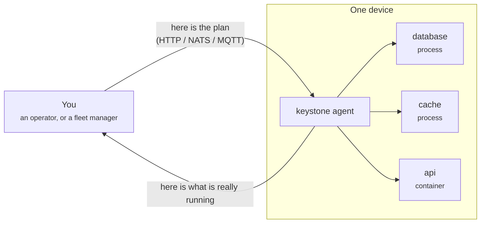

+++
archetype = "home"
title = "Keystone"
description = "A lightweight edge orchestration agent. Processes first, containers when needed."
+++

# Keystone

**A small program that keeps other programs running on a machine far away.**

That is the whole idea. You write down which programs a device should be running.
Keystone reads your list, installs what is missing, starts everything in the right
order, watches it, restarts what dies, and tells you honestly what is actually
alive.

{}
Imagine a box of toys in another city, and you cannot go there.

You write a note: *"Toy train first, then the tracks, then the little station."*
You post the note through the letterbox. Somebody inside the box reads it, takes
each toy out in the right order, sets it up, and then watches them play. If the
train falls over, they stand it back up. If you ask "is everything okay?", they
look at the toys and tell you the truth — they never say "all fine" while the
train is lying on the floor.

Keystone is the somebody inside the box.
{}

## Why it exists

Edge devices are not cloud servers. They have little memory, sometimes no
container runtime, flaky networks, and nobody nearby to reboot them. Keystone is
built for that:

- **Processes first, containers when needed.** A native process costs almost
  nothing. Containers are supported when you want them, not required.
- **One static binary.** No daemon zoo, no Kubernetes, no Python runtime.
- **Atomic deployments with rollback.** A deployment either lands or is undone.
- **Honest state.** If a component is dead, the API says so. This is a design
  guarantee, not an aspiration — see [Component state](concepts/component-state/).
- **Secure by default.** Signed artifacts and recipes, loopback-only API unless
  you provide a token, and per-component privilege dropping.

## Where to start

{}

## The shape of it in one picture

You send a **plan**. The agent turns it into running **components**. It keeps
answering what is true, and it keeps them alive.
