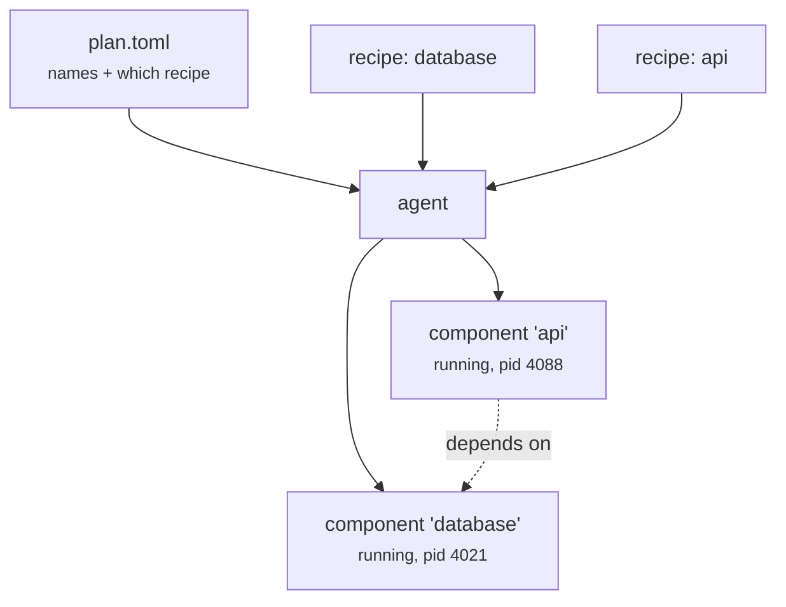

+++
title = "The four words"
weight = 12
description = "Recipe, plan, component, agent — everything else is detail."
+++

# The four words

Learn these four and the rest of the documentation reads easily.

## Recipe

**How to install and run one piece of software.** A TOML file, usually kept in
version control next to the software it describes.

```toml
[metadata]
name = "com.acme.api"
version = "1.4.0"

[[artifacts]]
uri = "https://downloads.acme.com/api-1.4.0.tar.gz"
sha256 = "9f2c…"
sig_uri = "https://downloads.acme.com/api-1.4.0.tar.gz.sig"
unpack = true

[lifecycle.run.exec]
command = "./api"
args = ["--port", "8080"]

[lifecycle.run.health]
check = "http://127.0.0.1:8080/healthz"
interval = "10s"

[[dependencies]]
name = "com.acme.database"
```

A recipe is a *class*: it describes a kind of thing. Full detail in
[Recipes](../../concepts/recipes/).

## Plan

**Which recipes this device should be running, and under what names.** Also TOML,
and deliberately tiny.

```toml
[[components]]
name = "database"
recipe = "recipes/com.acme.database.toml"

[[components]]
name = "api"
recipe = "recipes/com.acme.api.toml"
```

A device has exactly one plan at a time. Sending a new one is how you deploy. See
[Plans](../../concepts/plans/).

## Component

**A recipe, running, under the name the plan gave it.** A component is an
*instance*: it has a state (`running`, `stopped`, `failed`), a PID, a restart
count and a health verdict.

The same recipe can appear twice in a plan under two names — two components, one
recipe.

## Agent

**The `keystone` binary on the device.** It owns the plan, the components, and the
truth about them. Everything else — the CLI, the REST API, the NATS and MQTT
adapters — is a way of asking the agent to do something.

## How they fit together


