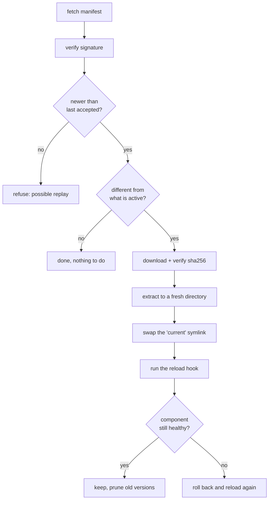

+++
title = "Datasets"
weight = 27
description = "Data the component reads and the agent keeps fresh, without restarting it."
+++

A **dataset** is a body of data a component reads and the agent keeps current:
the IEEE OUI list, a vulnerability feed, a model file. It is refreshed on a
schedule, verified before it is trusted, activated atomically, and rolled back
if the component cannot live with it.

{}
The recipe is the recipe. The dataset is the ingredients, and they get delivered
fresh every morning. Nobody rebuilds the kitchen for a delivery — the box is
swapped and the cook is told to look again.
{}

## Why not just an artifact

An `[[artifacts]]` entry is **immutable and identified by a digest written into
the recipe**, and the recipe is signed. That is exactly right for code, and
impossible for data published every night: the digest changes daily, so the
recipe would need re-signing daily — and a changed recipe is precisely what
[reconcile](../reconcile-and-reuse/) answers by restarting the component.

A discovery engine watching an industrial network cannot go down every night
because a vulnerability feed arrived. So a dataset moves the part that changes
out of the part that is stable:

| | Artifact | Dataset |
|---|---|---|
| Identity | Digest in the signed recipe | Discovered from a signed manifest |
| Changes | With the recipe version | On its own schedule |
| On change | Component restarts | Component reloads, same PID |
| Lives in | `runtime/artifacts` | `runtime/datasets` |

## Declaring one

```toml
[[datasets]]
name     = "oui"
manifest = "https://hub.plant.local/oui.manifest.toml"
cert_uri = "https://hub.plant.local/signer.pem"   # or KEYSTONE_LEAF_CERT
refresh  = "24h"     # monotonic interval, not a cron expression
max_age  = "72h"     # older than this is reported stale
keep     = 2         # versions retained: rollback target and delta base
required = true      # default: fail the install if it cannot be fetched

[lifecycle.reload]
signal = "SIGHUP"    # or script = "..." for containers
grace  = "30s"       # how long the component has to prove it survived
```

The component finds it through an environment variable — the path is absolute
and always points at the current version:

```bash
KEYSTONE_DATASET_OUI=/opt/keystone/runtime/datasets/oui/current
```

`refresh` is a duration and not a cron expression on purpose. A monotonic
interval survives a device whose clock jumps by decades when NTP first syncs,
needs no timezone and no DST rule, and needs no catch-up policy: on the first
boot after a long power-off the interval has elapsed, so the device refreshes
immediately.

## The manifest

The signed document that says which version is current:

```toml
schema    = 1
name      = "com.example.cve-bundle"
version   = "2026-08-15"
published = 2026-08-15T03:00:00Z

[artifact]
uri    = "https://hub.plant.local/datasets/cve-2026-08-15.tar"
sha256 = "…"
size   = 184320000
```

Published with a detached `<manifest>.sig` next to it. Build and sign it with
[`keystonectl manifest`](../../reference/keystonectl/).

### The anti-replay rule

**The agent refuses any manifest whose `published` is not strictly newer than
the last one it accepted**, and remembers that across restarts.

Without it, the signature chain does not protect you from the most obvious
attack on a security product: someone who can serve your URL hands back a
perfectly valid, perfectly signed bundle from six months ago, and the scanner
using it reports no vulnerabilities. A scanner that lies is worse than one that
is down.

Note what the rule does *not* consult: the local clock. It compares two signed
values with each other, so a device with no RTC enforces it exactly like any
other. It also works the other way round — an accepted manifest's timestamp is
proof that time has passed, so it [raises the agent's known-good
time](../../security/signing/#devices-whose-clock-cannot-be-trusted).

## What happens on a refresh



Only the first two steps happen on a quiet day, and the manifest is a few
hundred bytes.

## Activation is atomic

Each version lives in its own directory, and `current` is a symlink swapped with
`rename(2)`:

```
runtime/datasets/oui/2026-08-14/     ← kept: rollback target, delta base
runtime/datasets/oui/2026-08-15/
runtime/datasets/oui/current -> 2026-08-15
```

No reader ever sees a half-written state. Two consequences worth knowing:

- **`runtime/` must be one filesystem.** A cross-device rename fails, and a
  separate `/var` or an overlay is common on an edge image.
- **A process holding the old file open keeps reading it** until it reopens.
  That is what the reload hook is for.

## Reload, and when rollback cannot help

After the swap the agent runs the reload hook, waits `grace`, and keeps the new
version only if the component came through it. Otherwise it puts the previous
version back and reloads again — a feed one day old is a much smaller problem
than a component that will not run.

{}
Without `[lifecycle.run.health]` there is no verdict to wait for, and the agent
can confirm nothing beyond "the process is still alive" at the end of the grace
period. Declare a health check on any component that consumes a dataset.
{}

And note what a rollback restores: the **data**. If the bad dataset killed the
component outright, the previous data is back but the process is not — its
restart policy brings it up (the default, `always`, does), or a
[periodic reconcile](../reconcile-and-reuse/#reconciling-on-a-timer) does. With
`restart_policy = "never"` and no reconcile, nothing will.

A container has no PID to signal, so `signal` is rejected for one; use `script`
(`docker kill -s HUP …`). Rejected rather than ignored: a reload that silently
does nothing leaves the component reading stale data with no indication.

## Seeing it

```bash
curl -s localhost:8080/v1/datasets | jq
```

```json
[
  {
    "name": "oui",
    "version": "2026-08-15",
    "published": "2026-08-15T03:00:00Z",
    "path": "/opt/keystone/runtime/datasets/oui/current",
    "lastRefresh": "2026-08-15T03:04:11Z",
    "lastResult": "ok",
    "ageSeconds": 251,
    "stale": false
  }
]
```

`keystone_dataset_age_seconds` and `keystone_dataset_stale` export the same
thing. **Alert on them.** A device that has not refreshed in six weeks looks
identical to a healthy one in every other way, and a scanner working from a
six-week-old feed still answers — it just answers wrongly.

When the device's clock cannot be trusted, age is reported as `ageUnknown`
rather than computed, and the metric is withdrawn instead of being published as
a guess. A plausible wrong number would silence the alert that should have
fired.

To pull one now rather than wait for its interval:

```bash
curl -X POST localhost:8080/v1/datasets:refresh
```
