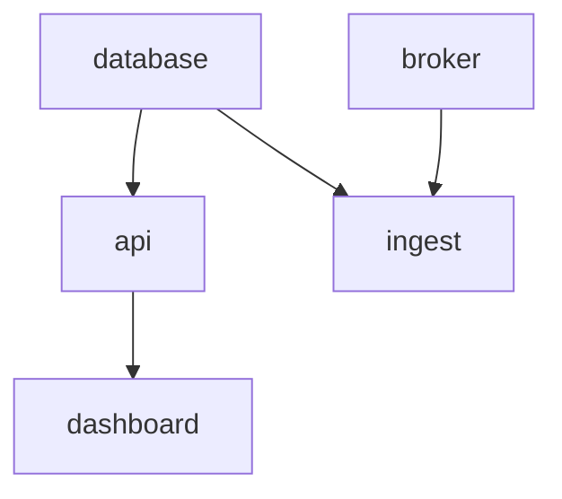
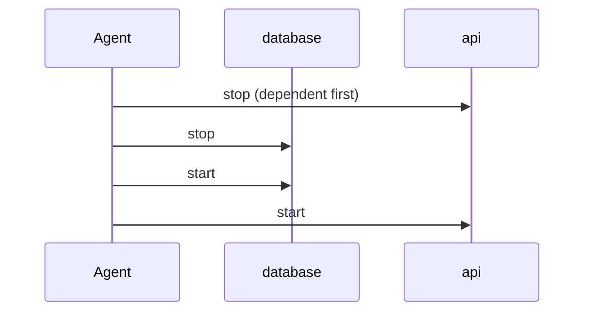

+++
title = "Dependencies"
weight = 23
description = "Start order, restart cascades, and the three dependency types."
+++

Dependencies do two separate jobs, and Keystone lets you pick them independently:

1. **Ordering** — who starts before whom.
2. **Cascading** — who gets restarted when something they depend on restarts.

{}
The tracks must be laid before the train can run: that is *ordering*.

If someone rebuilds the tracks, the train has to stop and start again: that is
*cascading*.

Sometimes you rebuild the tracks and the train genuinely does not care. Then you
want ordering without cascading.
{}

## The three types

```toml
[[dependencies]]
name = "com.acme.database"
version = ">=2.0.0"
type = "hard"
```

| Type | Must exist in the plan | Cascades restarts | Use it when |
|---|---|---|---|
| `hard` *(default)* | yes | yes | Your component holds a connection or state that breaks when the dependency restarts |
| `soft` | no | yes | The dependency is optional on some devices, but if it is there you want the cascade |
| `ordering` | yes | no | Start order matters, but your component reconnects on its own |

An empty or missing `type` means `hard`, for backwards compatibility.

## Version constraints

`version` accepts standard semver constraints (`>=2.0.0`, `^1.2`, `~1.4.0`). The
constraint is checked against the dependency's `metadata.version`:

- **`hard` / `ordering`:** an unsatisfied constraint fails the apply.
- **`soft`:** an unsatisfied constraint logs a line and the dependency is ignored.

## Layers, not a chain

The graph is turned into **layers**. Everything in a layer starts in parallel;
the next layer waits for the previous one to be ready.



Here `database` and `broker` start together, then `api` and `ingest` together, then
`dashboard`. On a four-core device that is a real difference from a naive
sequential start.

A cycle in the graph is a hard error: the apply is refused with
`cycle detected in component graph`.

## What "ready" means

A layer is done when every component in it is ready, and *ready* depends on the
recipe:

- **No health check:** ready as soon as the process is spawned or the container is
  created.
- **With a health check:** ready when the probe first reports healthy.

If a component never becomes ready, its readiness times out (derived from the
health interval and threshold), the layer fails, and the apply rolls back.

## Restart cascades in practice

`keystonectl restart database` on the graph above, with `hard` edges everywhere,
restarts `database`, then `api` and `ingest`, then `dashboard` — in dependency
order. Change `dashboard`'s dependency to `ordering` and it is left running.

To see what a restart would touch without doing it:



A `hard` edge means the dependent is stopped **before** and started **after** its
dependency. An `ordering` edge would leave `api` alone entirely.


```bash
curl -s -X POST "http://127.0.0.1:8080/v1/components/database:restart?dry=true" | jq
```
