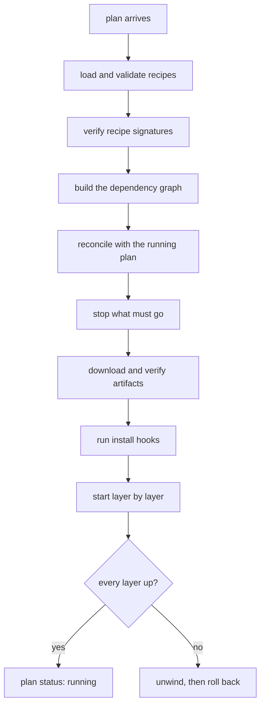
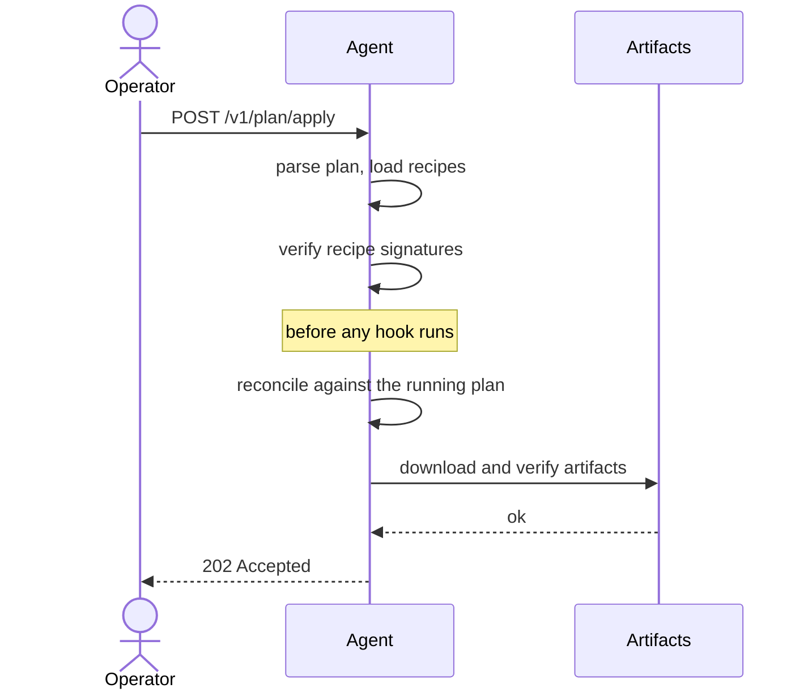
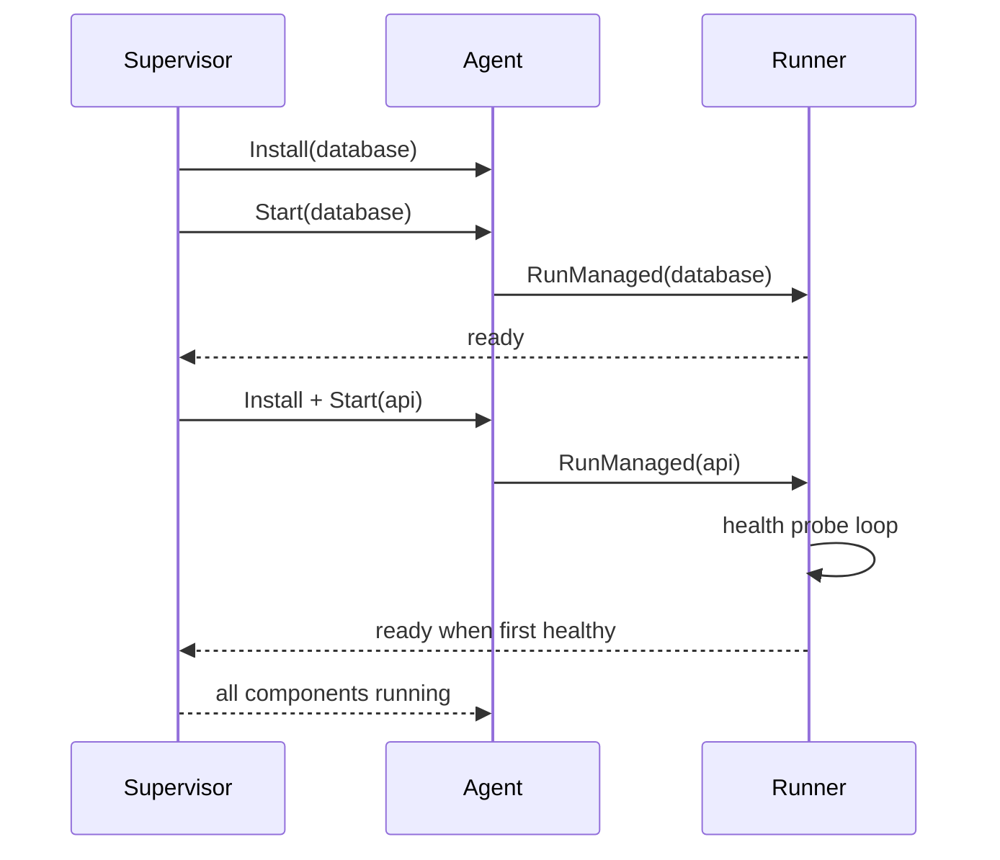
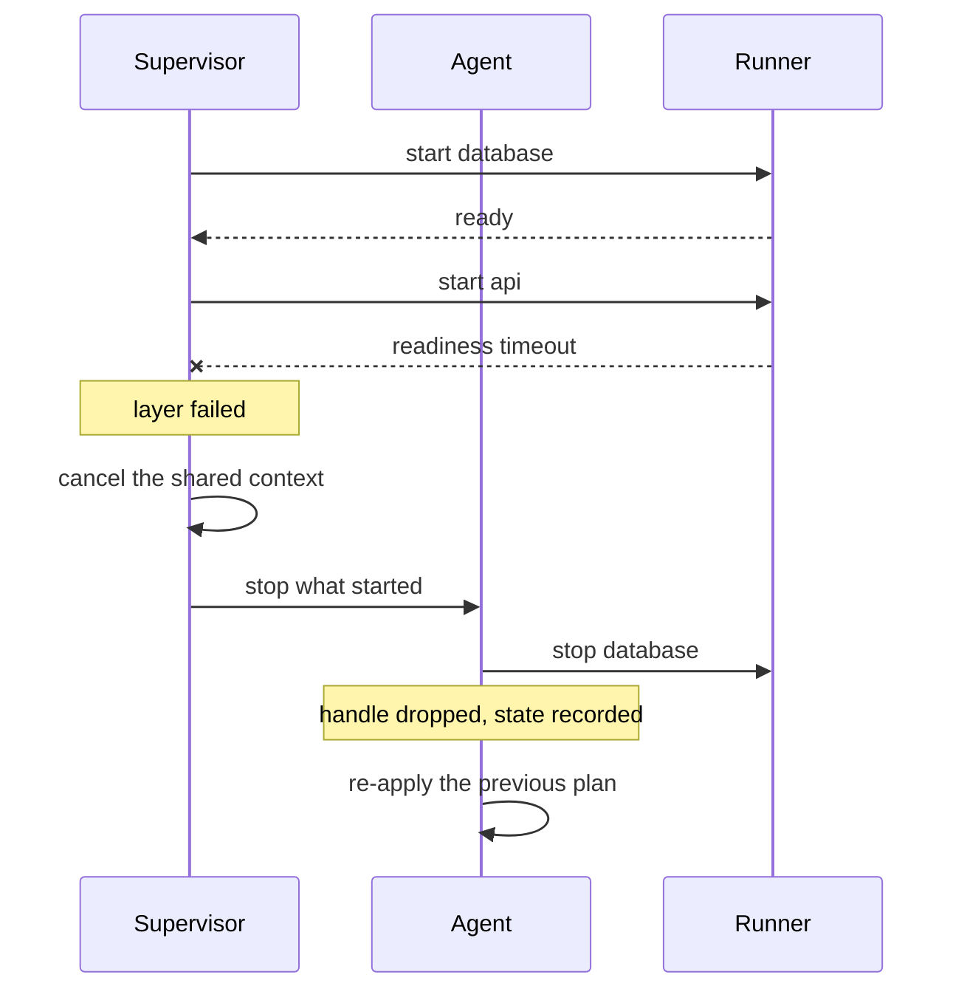
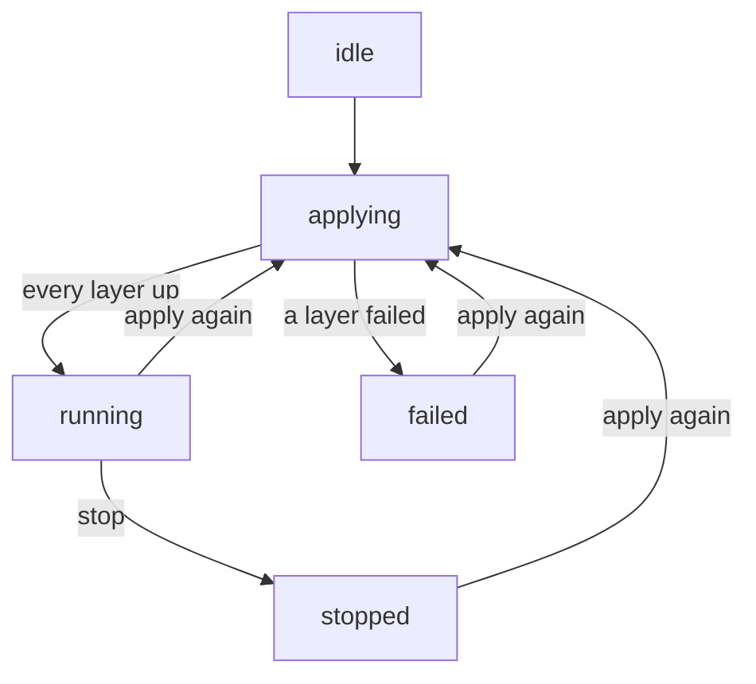

+++
title = "Plans"
weight = 22
description = "The device's desired state, and how applying one works."
+++

A plan is the list of components a device should be running. It is deliberately
almost empty of logic — all the detail lives in the recipes.

```toml
[[components]]
name = "database"
recipe = "recipes/com.acme.database.toml"

[[components]]
name = "api"
recipe = "recipes/com.acme.api.toml"

[[components]]
name = "metrics"
recipe = "com.acme.telegraf:1.2.0"     # from the agent's recipe store
```

- `name` is the component name — how you will refer to it in the API and the logs.
- `recipe` is either a **path** to a TOML file or a **`name:version`** reference to
  a recipe already in the agent's store (uploaded via `POST /v1/recipes`).

## Applying a plan

```bash
curl -X POST --data-binary @plan.toml http://127.0.0.1:8080/v1/plan/apply
keystonectl apply plan.toml                       # same thing
```

You upload the plan's **content**. Asking the agent to read a path of its own
(`{"planPath": …}`) is rejected: it would let anyone who can reach the API read
arbitrary files from the device.

To preview without touching anything:

```bash
curl -X POST --data-binary @plan.toml "http://127.0.0.1:8080/v1/plan/apply?dry=true"
```

A dry run logs the stop, start and no-touch sets and updates the reported plan
status to `dry-run`, but installs and starts nothing.

## What an apply actually does



The reconcile step is what makes re-applying cheap: unchanged components that are
alive and supervised are left completely alone. See
[Reconcile and reuse](../reconcile-and-reuse/).

## The same thing, as a conversation

Who calls whom during a successful apply of a two-component plan:



Signature verification happens **before** any hook, because an install hook is
arbitrary shell — verifying afterwards would be theatre.

Then the supervisor brings the components up, layer by layer:



`api` reports ready on its **first healthy probe**, not when its process appears,
which is what makes layered ordering mean something.

Two details the diagram makes obvious. Signature verification happens **before**
any hook, because an install hook is arbitrary shell — verifying afterwards would
be theatre. And `api` only reports ready on its **first healthy probe**, not when
its process appears, which is what makes layered ordering mean something.

## When it goes wrong



Step 8 is the one that used to be missing. Signalling the process without dropping
its handle left a component that still read as `running`, which the rollback then
adopted — the bug behind [#10](https://github.com/carlosprados/keystone/issues/10).

## Plan status

```bash
curl -s http://127.0.0.1:8080/v1/plan/status | jq
```

The response carries `planPath`, `status`, the component list, and `error` when the
last operation failed.



| Status | Meaning |
|---|---|
| `idle` | No plan has been applied |
| `applying` | An apply is in flight |
| `running` | The last apply succeeded |
| `failed` | The last apply failed (and rolled back, if it could) |
| `dry-run` | The last operation was a preview |
| `stopped` | Someone called `/v1/plan/stop` |

Only one apply runs at a time; a second concurrent request is rejected rather than
queued.

## Rollback

If any layer fails to come up, the agent stops what it started and re-applies the
**previous** plan. You end up back where you were, with an error explaining why:

```
apply failed and rollback was completed: api start: start readiness timeout
```

If the rollback itself fails you get both errors, and the plan status is `failed`.

## Stopping

```bash
curl -X POST http://127.0.0.1:8080/v1/plan/stop
```

Components are stopped in reverse dependency order, and the plan status becomes
`stopped` — which the agent takes as an explicit instruction, so it will **not**
resume that plan on the next boot.

## The graph endpoint

```bash
curl -s http://127.0.0.1:8080/v1/plan/graph | jq
```

Returns the nodes, the edges and the topological start order — useful for
rendering, and for checking that your `[[dependencies]]` blocks say what you
meant.
