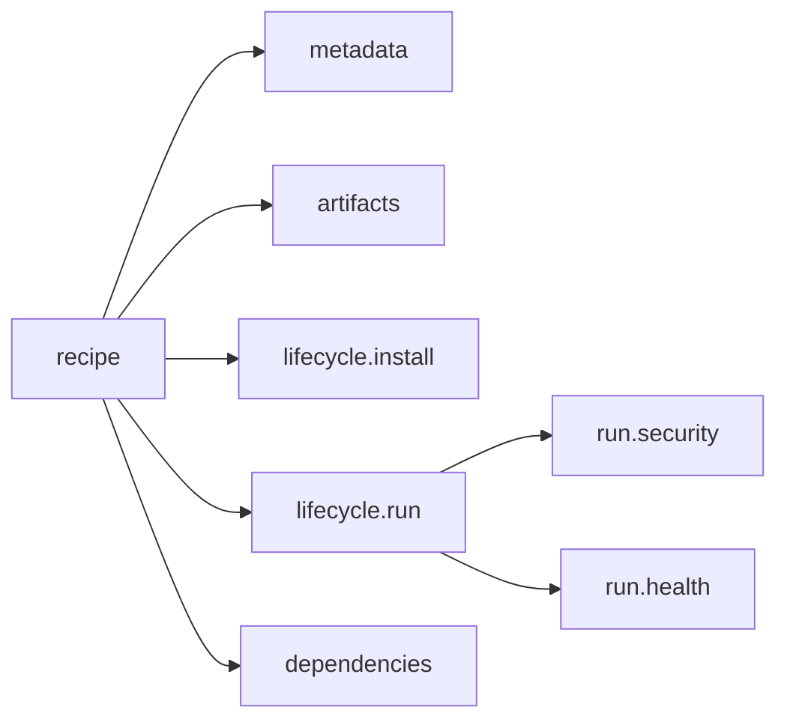

+++
title = "Recipes"
weight = 21
description = "The complete recipe format, field by field."
+++

A recipe describes **one piece of software**: where to get it, how to install it,
how to run it, how to tell whether it is healthy, and what it needs from other
components.




{}
A recipe is a cooking recipe. It says what to buy (artifacts), how to prepare it
(install), how to cook it (run), how to tell it is done (health), and what else
must be ready first (dependencies).
{}

## Metadata

```toml
[metadata]
name = "com.acme.api"        # required, unique; reverse-DNS is the convention
version = "1.4.0"            # required, semver
description = "Acme HTTP API"
publisher = "Acme Ltd"
type = ""                     # reserved
```

`name` and `version` together are the recipe's **identity**. Keystone uses that
identity, plus a digest of the file, to decide whether a component changed when you
re-apply a plan.

## Artifacts

Files to download before the component can run.

```toml
[[artifacts]]
uri = "https://downloads.acme.com/api-1.4.0.tar.gz"
sha256 = "9f2c8b1e…"                                     # required
sig_uri = "https://downloads.acme.com/api-1.4.0.tar.gz.sig"
cert_uri = "https://downloads.acme.com/signing-leaf.pem" # optional
unpack = true                                            # extract into the workdir
github_token = ""                                        # for private GitHub assets

[artifacts.headers]
Accept = "application/octet-stream"
```

Downloads resume, retry with backoff, and are cached under
`runtime/artifacts/<name>/<version>/`. **Both the SHA-256 and the signature are
mandatory** unless the agent runs with `--insecure-skip-verify`. Details in
[Artifacts](../../internals/artifacts/).

## Lifecycle: install

```toml
[lifecycle.install]
script = "chmod +x ./api && ./api --migrate"
require_privilege = false
```

A shell script run once in the component's working directory
(`runtime/components/<name>/<version>/`). A marker file makes it idempotent: it
will not run again on the next apply unless the version changes.

## Lifecycle: run

```toml
[lifecycle.run]
type = "process"              # "process" (default) or "container"
restart_policy = "always"     # "always" | "on-failure" | "never"
max_retries = 5               # 0 = the default of 5 for always/on-failure

[lifecycle.run.exec]
command = "./api"             # "./" is relative to the working directory
args = ["--port", "8080"]
working_dir = ""              # defaults to the component workdir

[lifecycle.run.exec.env]
LOG_LEVEL = "info"
```

Restart policies:

| Policy | Behaviour |
|---|---|
| `always` | Restart on any exit, and also when the health probe fails past its threshold |
| `on-failure` | Restart only on a non-zero exit. A clean exit is left alone (the component becomes `stopped`) |
| `never` | Never restart |

Restarts back off exponentially (1 s doubling to 60 s, ±25 % jitter) so a
crash-looping component cannot saturate the device.

## Lifecycle: run, in a container

```toml
[lifecycle.run]
type = "container"

[lifecycle.run.container]
image = "docker.io/library/nginx:1.27"
runtime = "auto"             # auto | containerd | cli | nerdctl | docker | podman
pull_policy = "if-not-present"
network_mode = "bridge"
user = "1000:1000"
privileged = false
hostname = "web"

[[lifecycle.run.container.mounts]]
source = "/srv/www"
target = "/usr/share/nginx/html"
read_only = true

[[lifecycle.run.container.ports]]
host_port = 8080
container_port = 80

[lifecycle.run.container.resources]
memory_mb = 256
cpu_quota = 50000
pids_limit = 128
```

See [Containers](../../internals/runners/) for how the runtime is chosen.

## Lifecycle: health

```toml
[lifecycle.run.health]
check = "http://127.0.0.1:8080/healthz"   # http:// | https:// | tcp:// | cmd:…
interval = "10s"
timeout = "2s"
failure_threshold = 3
```

Declaring a health check changes two things: the component is only considered
*ready* when it first probes healthy, and it is only eligible for reuse on a
re-apply while it is healthy.

Without a health check, `last_health` stays `unknown` forever. That is expected.

## Lifecycle: shutdown

```toml
[lifecycle.shutdown]
script = "./api --drain"
```

Best-effort hook run when the component is stopped. Failures are logged, not
fatal.

## Security

Process components only. The equivalent of a systemd unit's `User=`,
`NoNewPrivileges=` and `AmbientCapabilities=`:

```toml
[lifecycle.run.security]
user = "svc:svc"
no_new_privileges = true
capabilities = ["CAP_NET_BIND_SERVICE"]
```

Anything declared here is enforced or the component refuses to start. Full
semantics in [Process privileges](../../security/process-privileges/).

## Resources

```toml
[resources]
open_files = 4096      # RLIMIT_NOFILE, enforced
memory_limit = "256M"  # placeholder, not enforced for processes yet
cpu_quota = 50000      # placeholder, not enforced for processes yet
```

{}
For **process** components only `open_files` is enforced today. Memory and CPU
limits are honoured for containers, through
`[lifecycle.run.container.resources]`.
{}

## Dependencies

```toml
[[dependencies]]
name = "com.acme.database"   # another recipe's metadata.name
version = ">=2.0.0"          # optional semver constraint
type = "hard"                # hard (default) | soft | ordering
```

| Type | Must be in the plan? | Restarted when the dependency restarts? |
|---|---|---|
| `hard` | yes | yes |
| `soft` | no | yes, if present |
| `ordering` | yes | no |

`ordering` is the one people forget: use it when B must *start* after A but does
not care if A is later restarted. See [Dependencies](../dependencies/).

## Signing

A recipe loaded from a file must carry a detached signature
(`<recipe>.toml.sig`) verifiable against the trust bundle, checked **before any
hook runs**. Recipes pushed through the authenticated API are trusted by that
authentication instead. See [Signing](../../security/signing/).
