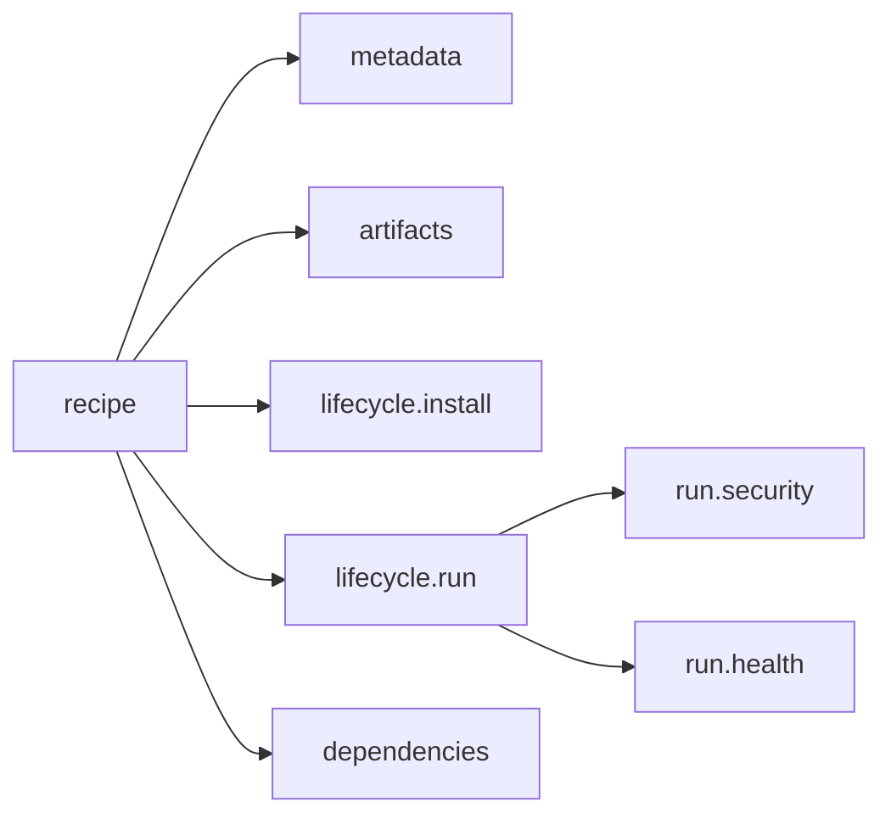

+++
title = "Recipes"
weight = 21
description = "The complete recipe format, field by field."
+++

A recipe describes **one piece of software**: where to get it, how to install it,
how to run it, how to tell whether it is healthy, and what it needs from other
components.

This page is about what the fields mean. If the TOML itself is what you are
fighting — why `[[artifacts]]` has two brackets, or why a misspelled field does
not raise an error — start with the
[TOML cheat sheet](../../reference/toml/).




{}
A recipe is a cooking recipe. It says what to buy (artifacts), how to prepare it
(install), how to cook it (run), how to tell it is done (health), and what else
must be ready first (dependencies).
{}

## Metadata

```toml
[metadata]
name = "com.acme.api"        # required, unique; reverse-DNS is the convention
version = "1.4.0"            # required, semver
description = "Acme HTTP API"
publisher = "Acme Ltd"
type = ""                     # reserved
```

`name` and `version` together are the recipe's **identity**. Keystone uses that
identity, plus a digest of the file, to decide whether a component changed when you
re-apply a plan.

## Artifacts

Files to download before the component can run.

```toml
[[artifacts]]
uri = "https://downloads.acme.com/api-1.4.0.tar.gz"
sha256 = "9f2c8b1e…"                                     # required
sig_uri = "https://downloads.acme.com/api-1.4.0.tar.gz.sig"
cert_uri = "https://downloads.acme.com/signing-leaf.pem" # optional
unpack = true                                            # extract into the workdir
github_token = ""                                        # for private GitHub assets

[artifacts.headers]
Accept = "application/octet-stream"
```

Downloads resume, retry with backoff, and are cached under
`runtime/artifacts/<name>/<version>/`. **Both the SHA-256 and the signature are
mandatory** unless the agent runs with `--insecure-skip-verify`. Details in
[Artifacts](../../internals/artifacts/).

### Patching instead of downloading

On a slow or metered link, an artifact can be updated by patching the version the
device already has:

```toml
[[artifacts]]
uri = "https://downloads.acme.com/api-1.4.0.tar.gz"   # unchanged, still the fallback
sha256 = "9f2c8b1e…"
unpack = true

[artifacts.delta]
server = "https://ota.acme.com"   # a delta server
sha256 = "4a71d0c3…"              # digest of the archive, uncompressed, after patching
```

Between two adjacent Keystone releases that turns a 13.4 MB download into 1.0 MB.
The saving is not fixed — a release that changes the Go toolchain is nearer 6 MB.

The block is optional and additive:

- **Nothing else changes.** The publisher keeps publishing the same `.tar.gz`; the
  patch is computed over its uncompressed form, which only exists on the device.
- **It always falls back.** First install, no patch on the server, a patch that
  does not apply, a digest that does not match — all of them download the whole
  artifact instead of failing the apply.
- **It is safe to roll out gradually.** An agent older than this field ignores it
  and downloads normally, so a recipe carrying a delta block can go to a fleet of
  mixed agent versions without coordinating an upgrade.

The `sha256` inside the block is what the patched result is checked against, and it
is trusted because the recipe itself is signed. How that changes who attests to the
bytes, and the current limits, are in
[Artifacts](../../internals/artifacts/#delta-downloads).

## Lifecycle: install

```toml
[lifecycle.install]
script = "chmod +x ./api && ./api --migrate"
require_privilege = false
```

A shell script run once in the component's working directory
(`runtime/components/<name>/<version>/`). A marker file makes it idempotent: it
will not run again on the next apply unless the version changes.

## Lifecycle: run

```toml
[lifecycle.run]
type = "process"              # "process" (default) or "container"
restart_policy = "always"     # "always" | "on-failure" | "never"
max_retries = 5               # 0 = the default of 5 for always/on-failure

[lifecycle.run.exec]
command = "./api"             # "./" is relative to the working directory
args = ["--port", "8080"]
working_dir = ""              # defaults to the component workdir

[lifecycle.run.exec.env]
LOG_LEVEL = "info"
```

Restart policies:

| Policy | Behaviour |
|---|---|
| `always` | Restart on any exit, and also when the health probe fails past its threshold |
| `on-failure` | Restart only on a non-zero exit. A clean exit is left alone (the component becomes `stopped`) |
| `never` | Never restart |

Restarts back off exponentially (1 s doubling to 60 s, ±25 % jitter) so a
crash-looping component cannot saturate the device.

## Lifecycle: run, in a container

```toml
[lifecycle.run]
type = "container"

[lifecycle.run.container]
image = "docker.io/library/nginx:1.27"
runtime = "auto"             # auto | containerd | cli | nerdctl | docker | podman
pull_policy = "if-not-present"
network_mode = "bridge"
user = "1000:1000"
privileged = false
hostname = "web"

[[lifecycle.run.container.mounts]]
source = "/srv/www"
target = "/usr/share/nginx/html"
read_only = true

[[lifecycle.run.container.ports]]
host_port = 8080
container_port = 80

[lifecycle.run.container.resources]
memory_mb = 256
cpu_quota = 50000
pids_limit = 128
```

See [Containers](../../internals/runners/) for how the runtime is chosen.

### Reaching another component by name

A container started by Keystone is named `keystone-<component>-<timestamp>`.
The timestamp is there so a restart never collides with a container still being
removed, which also means the container name is useless as an address: it is
different on every start.

The stable name is the **network alias**, and by default it is the component
name — the same thing a compose service name gives you:

```toml
# component "solver-service"
[lifecycle.run.container]
image        = "registry.example.net:5000/solver:sha-abc1234"
runtime      = "docker"
network_mode = "solver-net"          # a network you created beforehand

# component "api", on the same network, reaches it as solver-service:50051
```

Declare `network_aliases` only when the DNS name has to differ from the
component name:

```toml
network_aliases = ["solver", "solver.internal"]
```

Two limits, both enforced rather than papered over:

- **The network must be user-defined.** `bridge`, `host` and `none` have no
  embedded resolver, and the CLI rejects an alias there. Keystone refuses the
  recipe instead of emitting a flag that fails at run time.
- **`runtime = "containerd"` cannot do this.** CNI knows `host`, `bridge` and
  `none`, and has no equivalent of a network alias. A recipe that asks
  containerd for either is refused — without the check it would fall through
  every branch and start the container on an empty network namespace, with no
  error at all. Under `runtime = "auto"`, a user-defined network or an alias
  selects the CLI runtime.

**Keystone does not create the network.** It is machine preparation, not
deployment: create it with your configuration management (`docker network
create solver-net`) and Keystone will use it. A plan naming a network that does
not exist is refused before the container is created, naming the network and
the command that would create it — rather than after the image has been pulled,
which is where the runtime would have reported it.

A note on `hostname`, because the distinction is easy to get backwards: inside
a user-defined network, Docker's embedded resolver answers to the container
name, the alias **and** the hostname. On the default `bridge` it answers to
none of them. So the line that matters is the network, not which field you set
— and the alias is still the right one to use, because a container has exactly
one hostname and any number of aliases, and the alias is the one Keystone keeps
stable for you.

## Lifecycle: health

```toml
[lifecycle.run.health]
check = "http://127.0.0.1:8080/healthz"   # http:// | https:// | tcp:// | cmd:…
interval = "10s"
timeout = "2s"
failure_threshold = 3
```

Declaring a health check changes two things: the component is only considered
*ready* when it first probes healthy, and it is only eligible for reuse on a
re-apply while it is healthy.

Without a health check, `last_health` stays `unknown` forever. That is expected.

### Probing a container with no shell

`check = "cmd:…"` is a shell command line: it runs through `/bin/sh -c`. An
image built `FROM scratch` has no `/bin/sh`, so that probe fails every time —
and a health probe that never passes takes the deployment down with it, because
a failed probe rolls the plan back while reporting that it did the right thing.

Use `exec` instead, which is an argv handed to the workload directly:

```toml
[lifecycle.run.health]
exec     = ["/rotaflux", "healthcheck"]
interval = "10s"
```

It is the equivalent of compose's `test = ["CMD", "/rotaflux", "healthcheck"]`.
`check` and `exec` are two ways of saying the same thing, so declaring both is
refused. `exec` works for process components too, where it means "run this argv
on the host, without a shell in between".

## Lifecycle: state version

```toml
[lifecycle.run.state]
version = 21
```

One number, answering one question: **is it safe to roll this component back?**

Keystone's rollback reverts binaries and images. It never touches what a
component wrote. So for a component that migrates its data on startup and
cannot go back, reverting the binary is not a recovery — it is a second
failure, on top of the first, in a shape that looks nothing like a deployment
problem.

Raise the number in the recipe of the build that introduces a migration; leave
it alone for a build that reads everything its predecessor wrote. Before rolling
back, the agent compares the two plans and refuses to cross a migration
backwards. The details, and what the comparison deliberately does not do, are
in [Plans and rollback](../plans/#what-rollback-does-not-undo).

## Lifecycle: shutdown

```toml
[lifecycle.shutdown]
script = "./api --drain"
```

Best-effort hook run when the component is stopped. Failures are logged, not
fatal.

## Security

Process components only. The equivalent of a systemd unit's `User=`,
`NoNewPrivileges=` and `AmbientCapabilities=`:

```toml
[lifecycle.run.security]
user = "svc:svc"
no_new_privileges = true
capabilities = ["CAP_NET_BIND_SERVICE"]
```

Anything declared here is enforced or the component refuses to start. Full
semantics in [Process privileges](../../security/process-privileges/).

## Resources

```toml
[resources]
open_files = 4096      # RLIMIT_NOFILE on the component, enforced
```

`open_files` is set on the component's own process, never on the agent.

`memory_limit` and `cpu_quota` under `[resources]` are **refused**: a recipe that
declares either fails to apply, naming them. They used to be accepted and applied
to nothing, for every component type, so a recipe could declare a 256 MB limit
and run unbounded.

For a **container**, limits go in `[lifecycle.run.container.resources]`, and
every field there is applied under both containerd and the CLI runtimes:
`memory_mb`, `memory_swap` (MB, memory plus swap, `-1` unlimited; needs
`memory_mb`), `cpu_shares`, `cpu_quota` and `cpu_period` (µs; the period
defaults to 100000 and needs a quota), `pids_limit`.

For a **process**, there are no memory or CPU limits: run it as a container, or
place it in a systemd slice.

## Dependencies

```toml
[[dependencies]]
name = "com.acme.database"   # another recipe's metadata.name
version = ">=2.0.0"          # optional semver constraint
type = "hard"                # hard (default) | soft | ordering
```

| Type | Must be in the plan? | Restarted when the dependency restarts? |
|---|---|---|
| `hard` | yes | yes |
| `soft` | no | yes, if present |
| `ordering` | yes | no |

`ordering` is the one people forget: use it when B must *start* after A but does
not care if A is later restarted. See [Dependencies](../dependencies/).

## Signing

A recipe loaded from a file must carry a detached signature
(`<recipe>.toml.sig`) verifiable against the trust bundle, checked **before any
hook runs**. Recipes pushed through the authenticated API are trusted by that
authentication instead. See [Signing](../../security/signing/).
