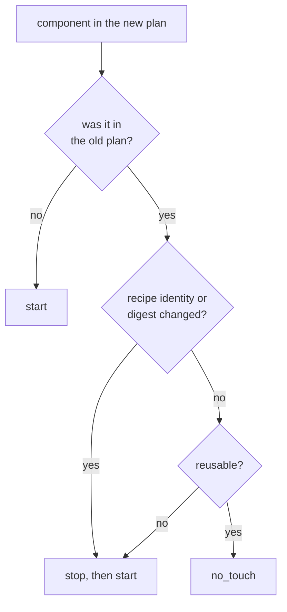
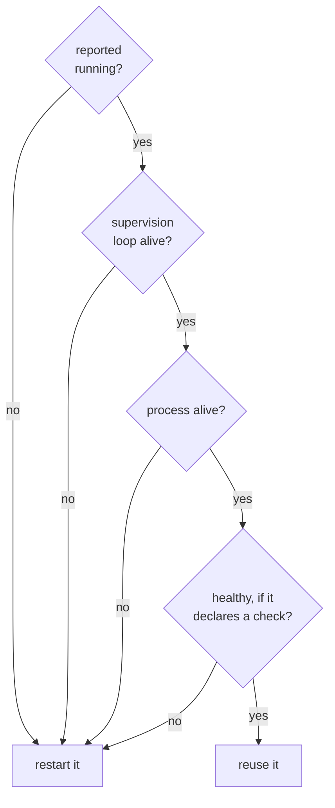

+++
title = "Reconcile and reuse"
weight = 25
description = "Why re-applying a plan does not restart your stack."
+++

Applying a plan is a **reconcile**, not a restart. Keystone compares what you want
with what is running and touches as little as possible.

{}
You hand in a new shopping list. Most of it is the same as last time, and those
things are already in the cupboard — so nobody goes shopping for them again. Only
the new and changed items get fetched.

But before ticking something off as "already in the cupboard", the cook actually
looks in the cupboard.
{}

## The three buckets

Every component in the new plan lands in exactly one bucket:

| Bucket | When | What happens |
|---|---|---|
| **start** | New, or its recipe changed, or it is not healthy/alive | Stopped if running, then installed and started fresh |
| **stop** | In the old plan, not in the new one | Stopped, in reverse dependency order |
| **no_touch** | Unchanged, alive, supervised, healthy | Left running, untouched — same PID |

The reconcile decision appears in the log on every apply:




```
[agent] reconcile stop_order=[legacy-agent] start_order=[api] no_touch=[database broker]
```

## What counts as "changed"

A component is considered changed when its **recipe identity**
(`metadata.name:metadata.version`) or the **digest of the recipe file** differs
from what was recorded for the running plan.

So editing a recipe in place — same version, different content — *does* trigger a
restart. That is deliberate: the digest is what tells the agent your intent
changed. If the previous digest is unknown (an older state file), the agent
conservatively restarts once.

Restarts then cascade to dependents according to each edge's
[dependency type](../dependencies/).

## Reuse has preconditions

A component is kept running only when **all** of these hold:




1. it is reported `running`;
2. it has a **live supervision loop**;
3. its **process is alive** (for process components, by probing the PID);
4. it is **healthy**, if the recipe declares a health check.

Point 2 is the subtle one. A reused component gets no new supervision loop —
whatever restart policy and health probe it has must *already* be attached.
Adopting a component nobody is watching produces exactly the failure this design
is meant to prevent: something reported as running, with no probe, no restart
policy, and no one to notice it died.

The check runs **twice**: once when the reconcile is planned, and again immediately
before the stack starts. A component can die in between — that window is precisely
what caused the production incident described in
[Component state](../component-state/). When the second check revokes a reuse, the
previous instance is torn down first, then a fresh one is started:

```
[agent] component=api msg=reusing existing running instance (no restart)
[agent] component=cache msg=reuse revoked, starting a fresh instance
```

## Why you should care

On a device you cannot afford to disturb, this is the difference between a config
tweak and an outage. Re-applying an unchanged plan is genuinely free:

```bash
keystonectl apply plan.toml     # PIDs unchanged, restart counters unchanged
```

Which means a fleet manager can safely re-assert the desired state on a schedule —
every hour, every boot, after every network partition — without churning
workloads. Convergence loops need that property.

## Reconciling on a timer

The agent can do that re-assertion itself, with no fleet manager and no
connectivity at all:

```bash
keystone --reconcile-interval 15m
```

What that repairs: a component whose restart policy gave up. When `RunManaged`
exhausts `max_retries` the component is recorded `failed` and stays that way
until a message arrives — which on an isolated gateway means forever. A periodic
pass puts it back in the **start** bucket, because a dead component fails the
reuse preconditions above, and leaves everything else alone.

Run one by hand with `keystonectl reconcile`.

Three properties worth knowing, because they are deliberate:

- **It is off unless you ask for it.** Switching it on by default would change
  how every device in a fleet behaves the moment the binary is updated. A pass
  is not free either: it re-verifies every recipe signature and re-hashes every
  recipe file.
- **It never resurrects a plan you stopped.** `keystonectl stop-plan` is
  remembered across reboots, and the timer honours it exactly as the boot resume
  does. The pass reports `skipped` and changes nothing.
- **It never rolls back.** An apply that fails rolls back to the previous plan;
  for a re-apply the "previous plan" is the same plan, so a rollback would stop
  every healthy component and re-apply the failure. On a timer that would repeat
  for as long as the cause persisted.

A pass that changes nothing — no plan applied, an apply already running, a plan
you stopped — is a success reporting `skipped`, not an error.

Watch it with `keystone_reconcile_repairs_total`. A device that repairs nothing
and a device that repairs the same component every night are very different
situations, and only that counter tells them apart.
