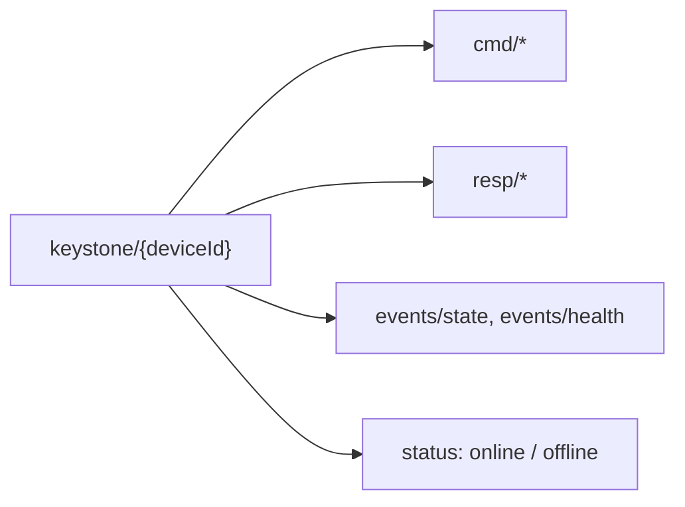

+++
title = "MQTT"
weight = 53
description = "Topics, QoS, and last-will for presence."
+++

The classic IoT transport, and usually the one already deployed. Works with any
MQTT 3.1.1 broker — Mosquitto, EMQX, HiveMQ, AWS IoT Core, Azure IoT Hub.

```bash
keystone --mqtt-broker tls://broker.acme.com:8883 --mqtt-device-id edge-001
```

## Topics




Everything under `keystone/{deviceId}/`:

| Direction | Topic | Purpose |
|---|---|---|
| agent subscribes | `keystone/{deviceId}/cmd/+` | `apply`, `stop`, `status`, `components`, `graph`, `restart`, `stop-comp`, `health`, `recipes`, `add-recipe` |
| agent publishes | `keystone/{deviceId}/resp/+` | One response topic per command |
| agent publishes | `keystone/{deviceId}/events/state` | Component state updates |
| agent publishes | `keystone/{deviceId}/events/health` | Health updates |
| agent publishes | `keystone/{deviceId}/status` | Last will: `online` / `offline` |

The command/response split (rather than MQTT 5 request/response) keeps it
compatible with 3.1.1 brokers, which is what most industrial gear speaks.

## Knowing what build is out there

The periodic state event carries `agentVersion`, and the health response carries
`agent_version` and `agent_commit`:

```json
{
  "timestamp": "2026-09-22T10:00:00Z",
  "deviceId": "gw-01",
  "agentVersion": "0.10.0",
  "planStatus": "running",
  "components": [ ... ]
}
```

It is reported rather than waited for on purpose. On a device that can only
reach outwards — behind NAT, no VPN, no jump host — this is the only way to
answer *what is running here*, and that answer is what tells you which devices
to upgrade, whether an upgrade landed at all, and which one has been sitting on
a withdrawn build for months. Asking each device would require being able to
reach it, which is exactly what this deployment shape does not allow.

## Presence via last will

The agent connects with a last-will message on `keystone/{deviceId}/status`. If it
drops off the network, the **broker** publishes `offline` on its behalf. Your fleet
view gets device presence for free, without polling — and, crucially, it works when
the device is unable to tell you anything itself.

## QoS

`--mqtt-qos` (default 1) applies to commands and responses:

| QoS | Guarantee | Use when |
|---|---|---|
| 0 | At most once | High-frequency telemetry you can afford to lose |
| 1 *(default)* | At least once | Commands. Handlers must tolerate a duplicate |
| 2 | Exactly once | You need it and the broker supports it well |

QoS 1 means a command can be delivered twice. That is fine here: applying the same
plan twice is a no-op thanks to [reconcile](../../concepts/reconcile-and-reuse/) —
the design of the apply path is what makes at-least-once delivery safe.

## TLS and credentials

```bash
keystone --mqtt-broker tls://broker:8883 --mqtt-device-id edge-001 \
         --mqtt-tls-ca /etc/keystone/ca.pem \
         --mqtt-tls-cert /etc/keystone/device.pem \
         --mqtt-tls-key /etc/keystone/device.key
```

Username/password (`--mqtt-user`, `--mqtt-pass`) works too. Every MQTT flag has a
`KEYSTONE_MQTT_*` environment equivalent, which is usually how you configure it
under systemd — see [Environment variables](../../reference/env/).

### A self-signed broker does not need verification turned off

Point `--mqtt-tls-ca` at the broker's own certificate:

```bash
keystone --mqtt-broker tls://broker.internal:8883          --mqtt-tls-ca /etc/keystone/broker-cert.pem
```

That keeps the encryption **and** the identity check. The certificate being
self-signed is not the problem; not knowing which certificate to expect is.

`--mqtt-tls-verify=false` also exists, for a lab where the certificate changes
under you. It accepts **any** certificate, so anyone able to intercept the
connection can impersonate the broker — on the channel that carries plans. The
agent logs a warning for the whole run when it is set. TLS 1.2 is the floor
either way.

## Broker ACLs are part of your security

Restrict each device's credentials to its own `keystone/{deviceId}/#` subtree.
Otherwise one compromised device can publish commands to every other device on the
broker. As with NATS, the `planPath` rejection is not yet implemented for this
adapter, so its ACLs are load-bearing.
