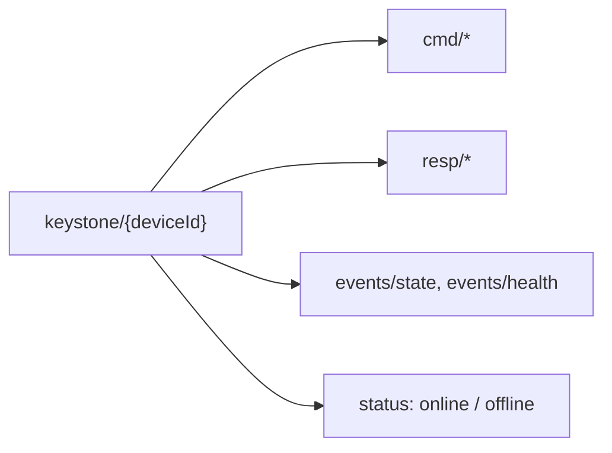

+++
title = "MQTT"
weight = 53
description = "Topics, QoS, and last-will for presence."
+++

The classic IoT transport, and usually the one already deployed. Works with any
MQTT 3.1.1 broker — Mosquitto, EMQX, HiveMQ, AWS IoT Core, Azure IoT Hub.

```bash
keystone --mqtt-broker tls://broker.acme.com:8883 --mqtt-device-id edge-001
```

## Topics




Everything under `keystone/{deviceId}/`:

| Direction | Topic | Purpose |
|---|---|---|
| agent subscribes | `keystone/{deviceId}/cmd/+` | `apply`, `stop`, `status`, `components`, `graph`, `restart`, `stop-comp`, `health`, `recipes`, `add-recipe` |
| agent publishes | `keystone/{deviceId}/resp/+` | One response topic per command |
| agent publishes | `keystone/{deviceId}/events/state` | Component state updates |
| agent publishes | `keystone/{deviceId}/events/health` | Health updates |
| agent publishes | `keystone/{deviceId}/status` | Last will: `online` / `offline` |

The command/response split (rather than MQTT 5 request/response) keeps it
compatible with 3.1.1 brokers, which is what most industrial gear speaks.

## Replacing the agent itself

`cmd/self-update` asks the device to replace the agent. The agent downloads the
binary, checks its digest and signature, and **proposes** it: it leaves the
binary, signature and certificate in `staging/` and exits so systemd starts it
again. It does not install anything. Under the A/B unit `/opt/keystone` is
read-only to the agent, and the pre-start gate, running as root, verifies the
proposal **again** with the version already installed, installs it into
`versions/` and moves `current`. A compromised agent can propose a binary, but
cannot get one run that the trust bundle does not vouch for.

```json
{
  "commandId": "upd-2026-09-24-01",
  "version": "v0.12.0",
  "uri": "https://artifacts.example.net/keystone-v0.12.0-arm64",
  "sha256": "…",
  "restart": true
}
```

`sha256` is required. Nothing is stopped while the binary downloads — the new
version is installed into its own directory and only the final restart
interrupts anything — and the response is published **before** the agent exits,
so the command that ordered the update is not the one whose answer disappears.

`restart: false` installs without restarting, leaving the timing to an operator
who knows when the device can afford it. The update does not take effect until
something restarts the agent.

If the new version fails to start, or starts and cannot prove itself, the
pre-start gate rolls it back without anyone asking. Proving itself means two
things: the plan converged, **and** a control plane has heard from the device —
see [self-update]({}) for why starting is not
enough on its own.

**Proving itself has a deadline.** The gate counts *starts*, and nothing else
restarts a version that starts fine and then cannot confirm — it converges and
never reaches the control plane, or reaches it and never converges. Such a
version would run unconfirmed forever. So a version on trial that has not
confirmed within `--self-update-confirm-timeout` (default 5 minutes) says so in
its log and exits for a restart, leaving its components running for the next
start to adopt. The gate counts that start, and rolls back after its limit
(three by default): about 15 minutes, with no component restarted along the
way. `0` disables the deadline, and with it the rollback of a mute version.

**`version` names the install directory**, and that name is the version's
identity from then on: the pending marker, the rollback target and the version
the device confirms. It does not have to match what the binary reports about
itself; release binaries report `0.12.4` and are usually named `v0.12.4`, and
both work.

**A version that failed can be retried.** It stays installed after the gate
rolls it back. Sending the same command again once the cause is fixed reuses
it — provided the binary is byte-for-byte the same. Different bytes under a name
already installed are refused: a version name must mean one binary everywhere.
The running version and the confirmed one are always refused.

**Requires `--self-update-root`.** An agent without it refuses the command
rather than half-answering, which is what every install upgraded from outside
should do.

## A broker that is away does not stop the agent

The agent starts whether or not the broker answers, and keeps retrying the
first connection every 10 s in the background; subscriptions and the online
status are set up whenever it succeeds. It used to exit when the first
connection failed, which on a device after a power cut — the router back after
the device — meant restarting in a loop supervising nothing until systemd gave
up on the unit. A control plane being away is the normal case at the edge, and
must never stop the agent running what it already knows.

## A slow command does not silence the channel

Each command handler runs in its own goroutine (`SetOrderMatters(false)`).
That is not a performance tweak — it is what keeps the device reachable.

An apply downloads artifacts, which can take minutes on a bad link. Paho's
default routes every message through one goroutine and its documentation is
explicit that handlers must not block; with that default, a long download makes
the agent stop answering **every** other command, stops the PINGRESP being
processed, and after `KeepAlive` the client decides the connection is dead and
reconnects. Measured on a 3m13s download: status queries unanswered, then
`response publish timeout`, then a reconnect — while HTTP on loopback answered
normally the whole time. The agent was never down; the only channel that could
reach it was.

Where MQTT is the only way in, that is the difference between watching an
update and waiting blind for it.

Concurrent commands are still safe: the agent refuses a second apply while one
is running rather than interleaving them, and the read-only commands answer
throughout. The refusal names what is running — a requested apply, the resume of
the saved plan after a boot, or a periodic reconcile — and is retryable.

## Knowing what build is out there

The periodic state event carries `agentVersion`, and the health response carries
`agent_version` and `agent_commit`:

```json
{
  "timestamp": "2026-09-22T10:00:00Z",
  "deviceId": "gw-01",
  "agentVersion": "0.10.0",
  "planStatus": "running",
  "components": [ ... ]
}
```

It is reported rather than waited for on purpose. On a device that can only
reach outwards — behind NAT, no VPN, no jump host — this is the only way to
answer *what is running here*, and that answer is what tells you which devices
to upgrade, whether an upgrade landed at all, and which one has been sitting on
a withdrawn build for months. Asking each device would require being able to
reach it, which is exactly what this deployment shape does not allow.

## Presence via last will

The agent connects with a last-will message on `keystone/{deviceId}/status`. If it
drops off the network, the **broker** publishes `offline` on its behalf. Your fleet
view gets device presence for free, without polling — and, crucially, it works when
the device is unable to tell you anything itself.

## QoS

`--mqtt-qos` (default 1) applies to commands and responses:

| QoS | Guarantee | Use when |
|---|---|---|
| 0 | At most once | High-frequency telemetry you can afford to lose |
| 1 *(default)* | At least once | Commands. Handlers must tolerate a duplicate |
| 2 | Exactly once | You need it and the broker supports it well |

QoS 1 means a command can be delivered twice. That is fine here: applying the same
plan twice is a no-op thanks to [reconcile](../../concepts/reconcile-and-reuse/) —
the design of the apply path is what makes at-least-once delivery safe.

## TLS and credentials

```bash
keystone --mqtt-broker tls://broker:8883 --mqtt-device-id edge-001 \
         --mqtt-tls-ca /etc/keystone/ca.pem \
         --mqtt-tls-cert /etc/keystone/device.pem \
         --mqtt-tls-key /etc/keystone/device.key
```

Username/password (`--mqtt-user`, `--mqtt-pass`) works too. Every MQTT flag has a
`KEYSTONE_MQTT_*` environment equivalent, which is usually how you configure it
under systemd — see [Environment variables](../../reference/env/).

### A self-signed broker does not need verification turned off

Point `--mqtt-tls-ca` at the broker's own certificate:

```bash
keystone --mqtt-broker tls://broker.internal:8883          --mqtt-tls-ca /etc/keystone/broker-cert.pem
```

That keeps the encryption **and** the identity check. The certificate being
self-signed is not the problem; not knowing which certificate to expect is.

`--mqtt-tls-verify=false` also exists, for a lab where the certificate changes
under you. It accepts **any** certificate, so anyone able to intercept the
connection can impersonate the broker — on the channel that carries plans. The
agent logs a warning for the whole run when it is set. TLS 1.2 is the floor
either way.

## Broker ACLs are part of your security

Restrict each device's credentials to its own `keystone/{deviceId}/#` subtree.
Otherwise one compromised device can publish commands to every other device on the
broker. As with NATS, the `planPath` rejection is not yet implemented for this
adapter, so its ACLs are load-bearing.
