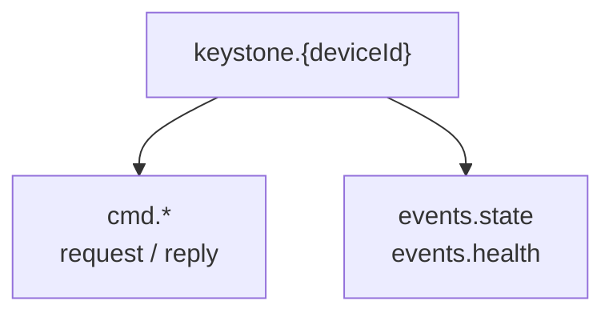

+++
title = "NATS"
weight = 52
description = "Subjects, authentication and the JetStream job queue."
+++

For fleets. One broker, thousands of devices, request/reply for commands and
publish for events — plus JetStream when commands must survive a device being
offline.

```bash
keystone --nats-url nats://broker.acme.com:4222 --nats-device-id edge-001
```

## Subjects




Everything under `keystone.{deviceId}.`:

**Commands** (request/reply):

```
keystone.{deviceId}.cmd.apply        keystone.{deviceId}.cmd.restart
keystone.{deviceId}.cmd.stop         keystone.{deviceId}.cmd.stop-comp
keystone.{deviceId}.cmd.status       keystone.{deviceId}.cmd.health
keystone.{deviceId}.cmd.components   keystone.{deviceId}.cmd.recipes
keystone.{deviceId}.cmd.graph        keystone.{deviceId}.cmd.add-recipe
```

**Events** (published by the agent):

```
keystone.{deviceId}.events.state     component state updates
keystone.{deviceId}.events.health    health updates
```

Publish intervals are configurable (`--nats-state-interval`, default 10 s;
`--nats-health-interval`, default 30 s; `0` disables).

## Authentication

Four mechanisms, in priority order when several are set: **NKey → creds → token →
user/password**.

```bash
keystone --nats-url tls://broker:4222 --nats-device-id edge-001 \
         --nats-nkey /etc/keystone/device.nk \
         --nats-tls-ca /etc/keystone/ca.pem
```

mTLS is supported with `--nats-tls-cert` / `--nats-tls-key`, and
`--nats-tls-verify=false` exists for testing only.

## JetStream

Without JetStream, a command sent to an offline device is lost. With it, commands
are durable and delivered when the device reconnects — which is what you want for
"roll out this plan to the fleet" when half the fleet is on a truck.

```bash
keystone --nats-url nats://broker:4222 --nats-device-id edge-001 \
         --nats-jetstream --nats-js-stream KEYSTONE_JOBS --nats-js-workers 2
```

`--nats-js-workers` sets how many jobs are processed concurrently. Note that plan
applies are serialised regardless: a second concurrent apply is rejected, not
queued.

## Fleet-wide patterns

Because subjects carry the device ID, a fleet manager can:

- target one device — `keystone.edge-001.cmd.apply`;
- subscribe to everything — `keystone.*.events.state` for a live fleet view;
- scope credentials per device with NATS subject permissions, so a compromised
  device cannot command its neighbours.

That last point is the reason to prefer per-device NKeys over a shared token.

{}
The `planPath` rejection that protects the HTTP adapter is **not** implemented for
NATS yet: this adapter still accepts a path, which lets an authorised publisher ask
the agent to read a local file. Off by default, and gated by broker ACLs — but keep
those ACLs tight.
{}
