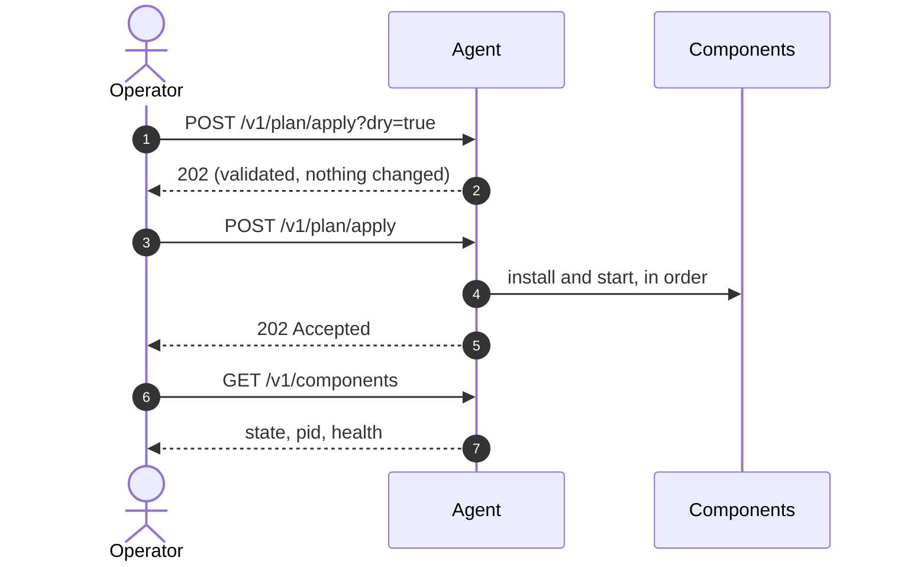

+++
title = "Deploying over HTTP"
weight = 253
description = "curl and keystonectl, including the recipe store and dry runs."
+++

The direct route: the agent's REST API. Best for local work, debugging, and a fleet
manager that can reach devices directly.

## The whole cycle



## Two ways to ship recipes

**Recipe files on the device.** The plan points at paths, and each recipe file needs
a `.sig` next to it:

```toml
[[components]]
name = "api"
recipe = "recipes/com.acme.api.toml"
```

**The recipe store.** Upload recipes through the API, then refer to them by
`name:version`. Recipes arriving this way are trusted through API authentication
rather than a file signature, so nothing needs to be signed on disk:

```bash
keystonectl upload-recipe recipes/com.acme.influxdb.toml
keystonectl upload-recipe recipes/com.acme.api.toml
keystonectl recipes
# ["com.acme.influxdb:2.7.5","com.acme.api:1.4.0"]
```

```toml
[[components]]
name = "api"
recipe = "com.acme.api:1.4.0"
```

The store is the better fit for a fleet: a controller pushes recipes once and then
sends small plans that reference them.

## The commands

```bash
export KS=http://127.0.0.1:8080
export TOKEN=$KEYSTONE_API_TOKEN          # only needed off loopback

# 1. validate without touching anything
curl -sS -X POST -H "Authorization: Bearer $TOKEN" \
     --data-binary @plan.toml "$KS/v1/plan/apply?dry=true" -w '%{http_code}\n'

# 2. apply
curl -sS -X POST -H "Authorization: Bearer $TOKEN" \
     --data-binary @plan.toml "$KS/v1/plan/apply" -w '%{http_code}\n'

# 3. watch it come up
watch -n1 "curl -s -H 'Authorization: Bearer $TOKEN' $KS/v1/components | \
  jq -r '.[] | \"\(.name)\t\(.state)\t\(.pid)\t\(.last_health)\"'"

# 4. one component at a time
curl -sS -X POST -H "Authorization: Bearer $TOKEN" \
     "$KS/v1/components/api:restart?wait=health&timeout=90s" | jq

# 5. tear down
curl -sS -X POST -H "Authorization: Bearer $TOKEN" "$KS/v1/plan/stop" -w '%{http_code}\n'
```

{}
Sending `{"planPath": "/etc/keystone/plan.toml"}` returns **400**. The body must be
the plan content: naming a path would let anyone who can reach the API read
arbitrary files off the device. This applies to HTTP; the messaging adapters still
accept a path.
{}

## Same thing with keystonectl

```bash
keystonectl apply-dry plan.toml
keystonectl apply plan.toml
keystonectl components
keystonectl restart api
keystonectl stop-plan
```

`keystonectl stop-plan` stops everything; `keystonectl stop api` stops one
component. They are different commands — see the
[keystonectl reference](../../reference/keystonectl/).

## Scripting a rollout

Because applying an unchanged plan is a no-op, a rollout script can be blunt:

```bash
#!/usr/bin/env bash
set -euo pipefail
for device in $(cat devices.txt); do
  echo "== $device"
  curl -fsS -X POST -H "Authorization: Bearer $TOKEN" \
       --data-binary @plan.toml "https://$device/v1/plan/apply" >/dev/null
  # wait until every component reports running
  for _ in $(seq 30); do
    if curl -fsS -H "Authorization: Bearer $TOKEN" "https://$device/v1/components" \
       | jq -e 'all(.[]; .state == "running")' >/dev/null; then
      echo "   ok"; break
    fi
    sleep 2
  done
done
```

No "is it already deployed?" check is needed. That property is what
[reconcile](../../concepts/reconcile-and-reuse/) buys you.
