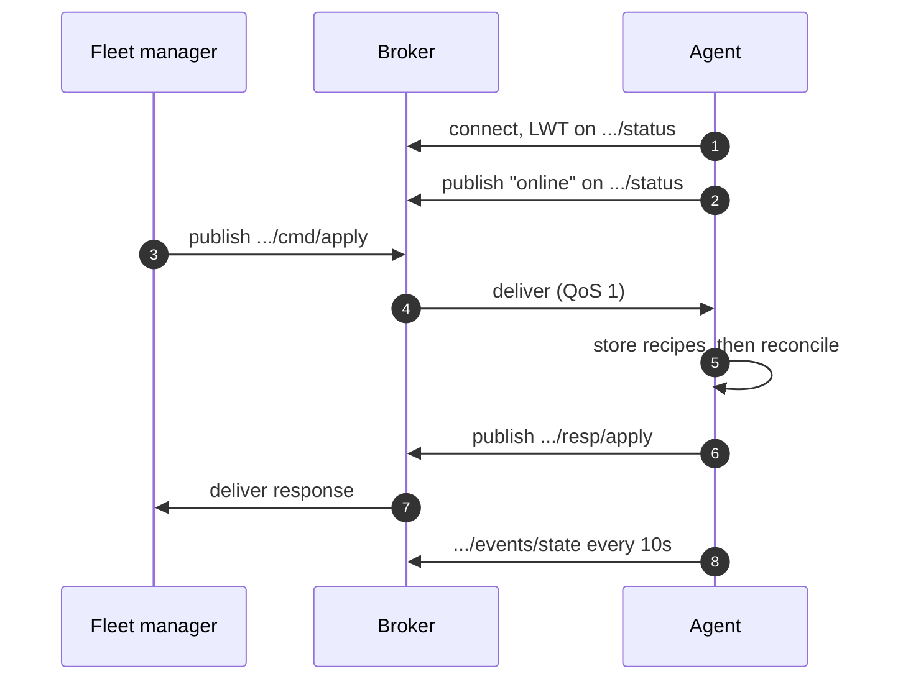

+++
title = "Deploying over MQTT"
weight = 254
description = "Exact topics and payloads, including shipping recipes and plan in one message."
+++

For fleets behind NAT, on cellular links, or wherever a broker already exists. The
device connects out; you never need to reach in.

```bash
keystone --http 127.0.0.1:8080 \
         --mqtt-broker tls://broker.acme.com:8883 \
         --mqtt-device-id edge-001 \
         --mqtt-tls-ca /etc/keystone/ca.pem \
         --mqtt-qos 1
```

## The conversation



If the device drops off the network, the **broker** publishes `offline` on its
behalf — presence without polling, and it works precisely when the device cannot
tell you anything itself.

## Recipes and plan in one message

This is the payload worth knowing about. `cmd/apply` accepts the recipes it needs
alongside the plan, stored before the plan is reconciled, in the same message:

```json
{
  "correlationId": "rollout-2026-08-06-a",
  "recipes": [
    "[metadata]\nname = \"com.acme.influxdb\"\nversion = \"2.7.5\"\n…",
    "[metadata]\nname = \"com.acme.api\"\nversion = \"1.4.0\"\n…"
  ],
  "content": "[[components]]\nname = \"influxdb\"\nrecipe = \"com.acme.influxdb:2.7.5\"\n\n[[components]]\nname = \"api\"\nrecipe = \"com.acme.api:1.4.0\"\n",
  "dry": false
}
```

Without that, you would publish `cmd/add-recipe` for each recipe, then `cmd/apply`,
and hope they arrive in order — a race with no clean fix over a lossy link. One
message removes it.

Fields (`ApplyRequest`):

| Field | Meaning |
|---|---|
| `correlationId` | Echoed back in the response, so you can match them |
| `commandId` | Identifies the command. A second delivery of the same id is ignored |
| `content` | The plan TOML |
| `recipes` | Recipe TOML documents, stored (with force) before reconciling |
| `dry` | `true` validates and reports without changing anything |

There is no `planPath`. It named a file on the device for the agent to read and
execute, which is a local-file-inclusion vector, and it was removed — the HTTP
adapter had refused it for the same reason for some time. A request that still
carries one is rejected by name rather than falling through to "content
required".

### Duplicates and retained messages

Two things about MQTT that matter more for commands than for telemetry:

- **A command must never be published with `retain`.** A retained message is
  redelivered on every subscribe, so a device that has been offline for weeks
  executes the order the moment it reconnects — including one that was
  withdrawn in the meantime. The agent refuses retained commands outright.

  **Testing this needs the agent stopped.** MQTT only sets the retained flag on
  delivery to a client that subscribes *afterwards*; publishing to a topic an
  agent is already subscribed to delivers an ordinary message with the flag
  clear. So publishing with `-r` while the agent runs does not exercise the
  guard at all — the command is simply executed, and any refusal you see came
  from somewhere else. To see it work, stop the agent, publish the retained
  message, then start it. That is also the situation the guard exists for: a
  gateway reconnecting to an order that has been sitting on the broker.

  Remember to clear a retained message afterwards (`mosquitto_pub -r -t <topic>
  -n`), or every reconnect keeps meeting it.
- **QoS 1 is at-least-once by design.** A duplicate delivery is the protocol
  working correctly, not a broker fault. For a status query that is noise; for
  an apply it is a second deployment. Send a `commandId` and the agent executes
  it once. Without one it cannot tell a retry from a deliberate repeat, and
  will run both.

Both checks apply to the commands that change something — apply, stop, restart,
stop-comp, add-recipe — and not to the read-only ones, which are the commands an
operator reaches for when things are already going wrong.

## Building and publishing it

Assembling that JSON by hand is unpleasant; let `jq` do the escaping:

```bash
DEV=edge-001

jq -n \
  --arg plan "$(cat plan.toml)" \
  --arg r1 "$(cat recipes/com.acme.influxdb.toml)" \
  --arg r2 "$(cat recipes/com.acme.api.toml)" \
  --arg cid "rollout-$(date -u +%Y%m%dT%H%M%SZ)" \
  '{correlationId: $cid, recipes: [$r1, $r2], content: $plan, dry: false}' \
  > apply.json

# listen for the answer first, then send
mosquitto_sub -h broker.acme.com -p 8883 --cafile /etc/keystone/ca.pem \
  -t "keystone/$DEV/resp/apply" -C 1 &

mosquitto_pub -h broker.acme.com -p 8883 --cafile /etc/keystone/ca.pem \
  -q 1 -t "keystone/$DEV/cmd/apply" -f apply.json
wait
```

The response, on `keystone/edge-001/resp/apply`:

```json
{ "correlationId": "rollout-20260806T143000Z", "success": true }
```

On failure, `success` is `false` and `error` carries the reason — including the
rollback summary if one happened.

## The other commands

Every command is `keystone/{deviceId}/cmd/<name>` with the response on
`keystone/{deviceId}/resp/<name>`:

```bash
# what is running
mosquitto_pub -t "keystone/$DEV/cmd/components" -m '{}'

# restart one component, waiting for health
mosquitto_pub -t "keystone/$DEV/cmd/restart" \
  -m '{"component":"api","wait":"health","timeout":"90s"}'

# stop one component
mosquitto_pub -t "keystone/$DEV/cmd/stop-comp" -m '{"component":"api"}'

# stop the whole plan
mosquitto_pub -t "keystone/$DEV/cmd/stop" -m '{}'

# add a recipe on its own
mosquitto_pub -t "keystone/$DEV/cmd/add-recipe" \
  -m "$(jq -n --arg c "$(cat recipes/com.acme.api.toml)" '{content:$c, force:true}')"
```

Commands that need no arguments still take `{}` — or a `{"correlationId":"…"}` if
you want the response matched.

## Watching a fleet

```bash
# every device's state, live
mosquitto_sub -h broker.acme.com -t 'keystone/+/events/state'

# who is up
mosquitto_sub -h broker.acme.com -t 'keystone/+/status' -v
```

## Two things to get right

**QoS 1 means duplicates.** A command can be delivered twice. That is safe here
because applying the same plan twice changes nothing — but if you wrap Keystone in
your own automation, keep that property.

**Broker ACLs are part of your security.** Restrict each device's credentials to
its own `keystone/{deviceId}/#` subtree, and make each device **subscribe-only**
on its command topics. A device publishes responses and events; it never issues
commands. If a compromised gateway can publish to a command topic — its own or
another's — the ACL is decoration, and that is the property that makes sharing a
broker with the data plane acceptable.
