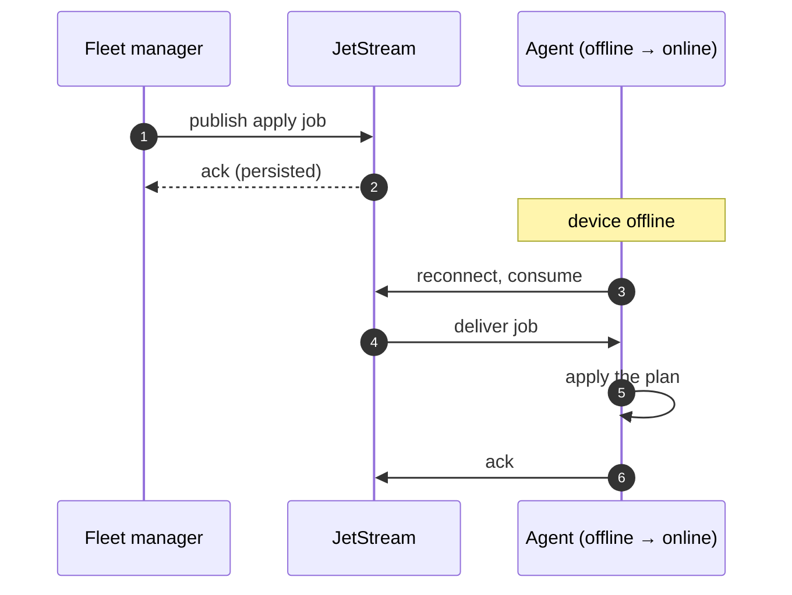

+++
title = "Deploying over NATS"
weight = 255
description = "Request/reply subjects, and JetStream for devices that are offline."
+++

For large fleets where you want request/reply semantics and durable commands.

```bash
keystone --http 127.0.0.1:8080 \
         --nats-url tls://broker.acme.com:4222 \
         --nats-device-id edge-001 \
         --nats-nkey /etc/keystone/device.nk \
         --nats-tls-ca /etc/keystone/ca.pem
```

## Apply a plan

Commands are request/reply, so there is no correlation ID to manage — the reply
comes back on the request's inbox:

```bash
DEV=edge-001

jq -n --arg plan "$(cat plan.toml)" '{content: $plan, dry: false}' \
  | nats req "keystone.$DEV.cmd.apply" --raw
```

The payload (`ApplyRequest`) is:

| Field | Meaning |
|---|---|
| `content` | The plan TOML |
| `planPath` | A plan file already on the device. Use `content` instead |
| `dry` | `true` validates and reports without changing anything |

{}
Unlike MQTT, the NATS `cmd.apply` payload has **no `recipes` field**. Upload recipes
first with `cmd.add-recipe`, or reference them as file paths in the plan:

```bash
nats req "keystone.$DEV.cmd.add-recipe" \
  "$(jq -n --arg c "$(cat recipes/com.acme.api.toml)" '{content:$c, force:true}')"
```
{}

## The other commands

```bash
nats req "keystone.$DEV.cmd.status"     '{}'
nats req "keystone.$DEV.cmd.components" '{}'
nats req "keystone.$DEV.cmd.graph"      '{}'
nats req "keystone.$DEV.cmd.restart"    '{"component":"api","wait":"health","timeout":"90s"}'
nats req "keystone.$DEV.cmd.stop-comp"  '{"component":"api"}'
nats req "keystone.$DEV.cmd.stop"       '{}'
nats req "keystone.$DEV.cmd.recipes"    '{}'
```

## Events

```bash
# one device
nats sub "keystone.$DEV.events.state"

# the whole fleet
nats sub "keystone.*.events.state"
nats sub "keystone.*.events.health"
```

Publish intervals are `--nats-state-interval` (10 s) and
`--nats-health-interval` (30 s); `0` disables either.

## JetStream: commands that survive a disconnect

Without JetStream, a request to an offline device is simply lost. With it, the
command is durable and delivered when the device reconnects — which is what you want
for "roll this plan out to the fleet" when part of the fleet is on a truck.

```bash
keystone --nats-url tls://broker:4222 --nats-device-id edge-001 \
         --nats-jetstream --nats-js-stream KEYSTONE_JOBS --nats-js-workers 2
```



Applies are serialised regardless of `--nats-js-workers`: a second concurrent apply
is rejected rather than queued, so two jobs for the same device cannot interleave.

## Per-device credentials

Subjects carry the device ID, which lets you scope credentials with NATS subject
permissions:

```
publish:   keystone.edge-001.events.>
subscribe: keystone.edge-001.cmd.>
```

Per-device NKeys with permissions like that are the reason to prefer NKeys over a
shared token: a compromised device cannot command its neighbours.

{}
As with MQTT, the `planPath` rejection that protects the HTTP adapter is not yet
implemented here, so an authorised publisher can ask the agent to read a local file.
Keep the subject permissions tight.
{}
