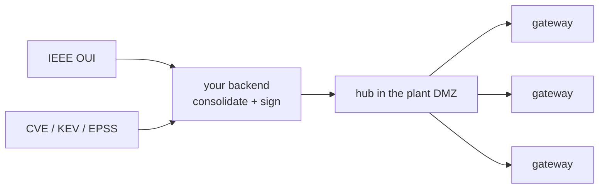

+++
title = "Keeping an OT scanner's data fresh"
weight = 256
description = "IEEE OUI vendor prefixes and a daily vulnerability feed, published signed and refreshed without restarting the scanner."
+++

A device-discovery product for OT networks needs two bodies of data that will
not sit still:

- **IEEE OUI / MA-L** — the vendor prefixes that turn a MAC address into "this
  is a Siemens PLC". New assignments appear continuously; a list a year old
  reports unknown vendors for equipment that has been on sale for months.
- **A vulnerability feed** — published daily. Discovering a device is only half
  the job; the customer bought the other half.

Both must refresh on their own, on gateways that may have no route to the
internet, without the scanner going down — and without the possibility of
somebody quietly feeding the fleet last March's vulnerability data.

## The shape of it



**One host per plant reaches the internet, not every gateway.** In OT that is
usually not a preference, it is the network you are given — and it also keeps a
fleet of gateways from hammering an upstream rate limit. Your backend
consolidates and signs; the hub serves; the gateways verify your signature and
never trust the upstream directly.

## Publishing a dataset

Consolidate whatever you ship into a tar, then build and sign a manifest:

```bash
# 1. Build today's bundle.
tar -cf cve-2026-08-15.tar -C build .

# 2. A manifest naming it, hashed from the file itself.
keystonectl manifest new \
  --name com.example.cve-bundle \
  --version 2026-08-15 \
  --published 2026-08-15T03:00:00Z \
  --uri https://hub.plant.local/datasets/cve-2026-08-15.tar \
  cve-2026-08-15.tar

# 3. Sign it, then check it the way an agent will — in CI, every night.
keystonectl manifest sign --key signer.key --cert signer.pem com.example.cve-bundle.manifest.toml
keystonectl manifest verify --trust-bundle ca.pem \
  --since 2026-08-14T03:00:00Z \
  com.example.cve-bundle.manifest.toml
```

`--since` takes the publication time already in the field. It fails if today's
manifest is not strictly newer — which is the same rule every agent applies, so
a publication that fails here would have been refused by the whole fleet.

{}
A day-to-day vulnerability bundle is the ideal case for
[delta updates](../delta-updates/) — and publishing it gzipped throws that away.
One changed byte reshuffles a gzip stream, so a patch over `.tar.gz` measures
98% of the full size; over the uncompressed tar of two adjacent versions, 3%.
{}

## The recipe

```toml
[metadata]
name    = "com.example.ot-scanner"
version = "2.1.0"

[[artifacts]]
uri      = "https://hub.plant.local/releases/ot-scanner-2.1.0.tar.gz"
sha256   = "…"
sig_uri  = "https://hub.plant.local/releases/ot-scanner-2.1.0.tar.gz.sig"
unpack   = true

# Vendor prefixes: they change, but not urgently.
[[datasets]]
name     = "oui"
manifest = "https://hub.plant.local/datasets/oui.manifest.toml"
cert_uri = "https://hub.plant.local/signer.pem"
refresh  = "168h"    # weekly
max_age  = "720h"    # a month behind is worth an alert
required = true      # a discovery product with no OUI list is wrong, not degraded

# Vulnerabilities: daily, and staleness matters much more.
[[datasets]]
name     = "cve"
manifest = "https://hub.plant.local/datasets/cve.manifest.toml"
cert_uri = "https://hub.plant.local/signer.pem"
refresh  = "24h"
max_age  = "72h"     # three missed nights and someone needs to know
required = true

[lifecycle.reload]
signal = "SIGHUP"
grace  = "30s"

[lifecycle.run]
type           = "process"
restart_policy = "always"

[lifecycle.run.exec]
command = "./ot-scanner"
args    = ["--listen", ":9000"]

# Declare a health check. Without one the agent cannot tell whether the scanner
# survived a new feed, so it cannot roll a bad one back.
[lifecycle.run.health]
check             = "http://localhost:9000/healthz"
interval          = "15s"
failure_threshold = 3
```

The scanner reads two environment variables the agent sets, both absolute and
both pointing at the current version:

```
KEYSTONE_DATASET_OUI=/opt/keystone/runtime/datasets/oui/current
KEYSTONE_DATASET_CVE=/opt/keystone/runtime/datasets/cve/current
```

On `SIGHUP` it reopens them. That is the whole contract, and it is what keeps a
nightly feed from becoming a nightly outage.

## What a night looks like

```
03:04  [dataset] name=cve version=2026-08-15 previous=2026-08-14 msg=activated
03:04  [dataset] component=scanner pid=1481 signal=SIGHUP msg=reload signalled
03:04  [dataset] name=cve msg=kept; pruned 2026-08-13
```

Same PID before and after. The OUI dataset is not touched — its own interval has
not elapsed.

If the new feed makes the scanner unhealthy inside its grace period:

```
03:04  [dataset] name=cve component=scanner msg=the component reported unhealthy;
                 rolling back to 2026-08-14
```

Yesterday's data is back and the scanner is serving from it. Worth being precise
about what that restores: the **data**. If a malformed feed killed the process
outright, `restart_policy = "always"` is what brings it back — onto the data
that has already been rolled back.

## Confirming it, and alerting on it

```bash
curl -s localhost:8080/v1/datasets | jq -r '.[] | "\(.name) \(.version) age=\(.ageSeconds)s stale=\(.stale)"'
```

```
oui 2026-08-11 age=345600s stale=false
cve 2026-08-15 age=251s stale=false
```

The alert that matters is not "the agent is down" — you would notice that. It is
this one:

```yaml
- alert: KeystoneDatasetStale
  expr: keystone_dataset_stale == 1
  for: 1h
  annotations:
    summary: "{{ $labels.name }} on {{ $labels.instance }} is past its max_age"
```

A gateway whose feed stopped updating six weeks ago keeps answering scans, keeps
reporting healthy, and keeps telling the customer their PLCs have no known
vulnerabilities. Nothing else on the device looks wrong. This is the signal.

## Air-gapped plants

Where the hub itself has no route out, the same manifests and tars can arrive on
removable media: point `manifest` at a `file:///…`-style local path and the
agent reads it from disk, verifying exactly the same signature and applying
exactly the same anti-replay rule. What changes is the transport, not the trust.
