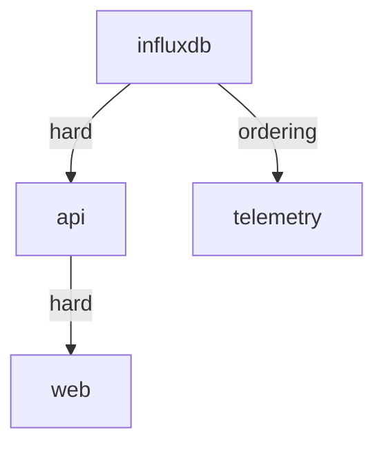

+++
title = "A four-component stack"
weight = 252
description = "Database, API, telemetry agent and a container front end, in the right order."
+++

The realistic case: several components, a dependency graph, mixed process and
container workloads, and one dependency that must **not** cascade.

## The shape



- `api` is **hard** on `influxdb`: it holds a connection pool, so it must restart
  when the database restarts.
- `telemetry` is **ordering** on `influxdb`: it writes metrics but reconnects on its
  own, so restarting the database should not disturb it.
- `web` is **hard** on `api`: it is a container serving a front end configured with
  the API's address.

Picking `ordering` for the telemetry agent is the decision that stops one database
restart from rippling through the whole device.

## The recipes

`recipes/com.acme.influxdb.toml` — a database with a slow start:

```toml
[metadata]
name = "com.acme.influxdb"
version = "2.7.5"

[[artifacts]]
uri = "https://artifacts.acme.com/influxdb-2.7.5-linux-arm64.tar.gz"
sha256 = "4d1b…"
unpack = true

[lifecycle.install]
script = "mkdir -p data && chmod +x ./influxd"

[lifecycle.run]
restart_policy = "always"

[lifecycle.run.exec]
command = "./influxd"
args = ["--bolt-path", "data/influxd.bolt", "--engine-path", "data/engine"]

[lifecycle.run.security]
user = "influx:influx"
no_new_privileges = true
capabilities = []

[lifecycle.run.health]
check = "http://127.0.0.1:8086/health"
interval = "10s"
timeout = "3s"
failure_threshold = 6
```

`failure_threshold = 6` with a 10 s interval gives it a minute to come up before the
apply gives up — a database that replays a write-ahead log needs that room.

`recipes/com.acme.api.toml` — as in [the single-service example](../service-from-release/),
plus the dependency:

```toml
[[dependencies]]
name = "com.acme.influxdb"
version = ">=2.7.0"
type = "hard"
```

`recipes/com.acme.telemetry.toml` — ordering, not cascading:

```toml
[metadata]
name = "com.acme.telemetry"
version = "1.29.0"

[[dependencies]]
name = "com.acme.influxdb"
type = "ordering"

[lifecycle.run]
restart_policy = "always"

[lifecycle.run.exec]
command = "./telemetry"
args = ["--config", "telemetry.conf"]

[lifecycle.run.security]
user = "telemetry:telemetry"
no_new_privileges = true
capabilities = []

[lifecycle.run.health]
check = "cmd:./telemetry --check"
interval = "30s"
```

`recipes/com.acme.web.toml` — a container:

```toml
[metadata]
name = "com.acme.web"
version = "1.27.0"

[[dependencies]]
name = "com.acme.api"
type = "hard"

[lifecycle.run]
type = "container"
restart_policy = "always"

[lifecycle.run.container]
image = "docker.io/library/nginx:1.27-alpine"
runtime = "auto"
pull_policy = "if-not-present"
network_mode = "bridge"
user = "101:101"
privileged = false

[[lifecycle.run.container.ports]]
host_port = 80
container_port = 80

[[lifecycle.run.container.mounts]]
source = "/srv/acme/www"
target = "/usr/share/nginx/html"
read_only = true

[lifecycle.run.container.resources]
memory_mb = 128
pids_limit = 64

[lifecycle.run.health]
check = "http://127.0.0.1:80/"
interval = "15s"
```

{}
Container components are confined through `[lifecycle.run.container]` — `user`,
`privileged`, resource limits. Putting `[lifecycle.run.security]` on a container
component is rejected when the plan is applied, and the reverse is too. See
[Process privileges](../../security/process-privileges/).
{}

## The plan

`plan.toml`:

```toml
[[components]]
name = "influxdb"
recipe = "recipes/com.acme.influxdb.toml"

[[components]]
name = "api"
recipe = "recipes/com.acme.api.toml"

[[components]]
name = "telemetry"
recipe = "recipes/com.acme.telemetry.toml"

[[components]]
name = "web"
recipe = "recipes/com.acme.web.toml"
```

## Deploy, and check the order first

```bash
keystonectl apply-dry plan.toml      # validates and prints the plan, changes nothing
keystonectl graph                    # the resolved order
keystonectl apply plan.toml
```

The dry run loads every recipe, verifies every signature and computes the reconcile —
without installing anything. It is the cheapest way to catch a bad dependency or an
unsigned artifact.

## What the layers do

```
[agent] reconcile stop_order=[] start_order=[influxdb api telemetry web] no_touch=[]
[supervisor] layer=0 components=[influxdb] msg=starting layer
[supervisor] component=influxdb state=running
[supervisor] layer=1 components=[api telemetry] msg=starting layer
[supervisor] component=telemetry state=running
[supervisor] component=api state=running
[supervisor] layer=2 components=[web] msg=starting layer
[supervisor] component=web state=running
[supervisor] all components running
```

`api` and `telemetry` start **in parallel** — they are both in layer 1 — which on a
four-core box is the difference between a 40-second and a 90-second deployment.

## Prove the cascade behaves

```bash
# what a database restart would touch, without doing it
curl -s -X POST "localhost:8080/v1/components/influxdb:restart?dry=true" | jq
```

```json
{ "stopOrder": ["web", "api", "influxdb"], "startOrder": ["influxdb", "api", "web"] }
```

`telemetry` is absent — that is the `ordering` dependency doing its job. Now for
real, waiting until the API is healthy again rather than merely started:

```bash
curl -s -X POST "localhost:8080/v1/components/influxdb:restart?wait=health&timeout=120s" | jq
```

```json
{
  "component": "influxdb",
  "pid": 41002,
  "dependents": { "api": 41088, "web": 41120 },
  "wait": "health",
  "timeout": "2m0s"
}
```

## Updating one component

Bump `com.acme.api` to 1.5.0 in its recipe, then re-apply:

```bash
keystonectl apply plan.toml
```

```
[agent] reconcile stop_order=[web api] start_order=[api web] no_touch=[influxdb telemetry]
[agent] component=influxdb msg=reusing existing running instance (no restart)
[agent] component=telemetry msg=reusing existing running instance (no restart)
```

The database and the telemetry agent are never touched; `web` restarts because it is
`hard` on `api`. That is the whole point of reconciling rather than restarting.
