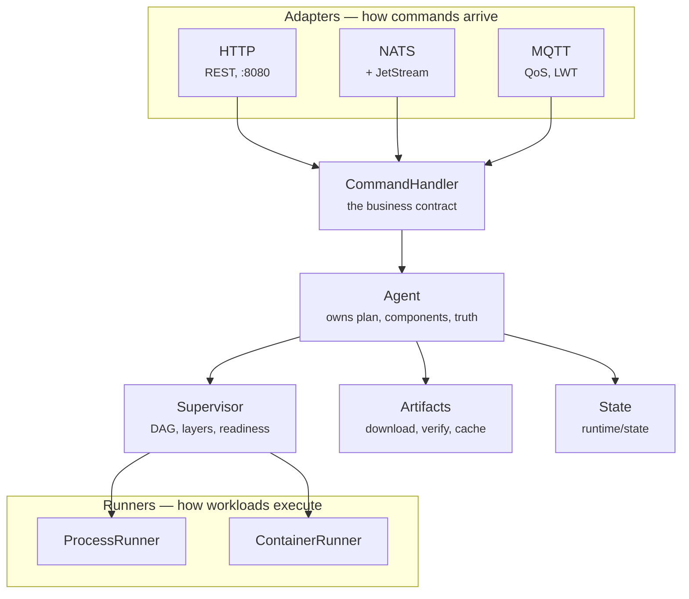

+++
title = "Architecture"
weight = 31
description = "The three interfaces the whole design hangs from."
+++

# Architecture

Keystone is small enough to hold in your head. Three interfaces carry the entire
design.



## Interface 1: Adapter

```go
type Adapter interface {
    Name() string
    Start(ctx context.Context) error
    Stop(ctx context.Context) error
}
```

A transport, nothing more. A `Registry` starts them all and stops them all with a
shutdown deadline. Adding a control plane means writing one of these — it cannot
accidentally introduce new behaviour, because all it can do is call the next
interface.

## Interface 2: CommandHandler

```go
type CommandHandler interface {
    ApplyPlan(planPath string, dry bool) error
    StopPlan() error
    GetComponents() []store.ComponentInfo
    RestartComponent(name, wait string, timeout time.Duration) (*adapter.RestartResult, error)
    // …
}
```

Every adapter speaks this, and `Agent` is the only implementation. This is why HTTP,
NATS and MQTT cannot drift apart in behaviour: there is exactly one code path
behind them.

## Interface 3: Runner

```go
type Runner interface {
    Start(ctx context.Context, opts Options) (Handle, error)
    Stop(ctx context.Context, h Handle, timeout time.Duration) error
    RunManaged(ctx context.Context, name string, opts Options, hc HealthConfig,
        policy RestartPolicy, maxRetries int,
        onStart func(Handle), onHealth func(bool), onExit func(error)) error
}
```

`RunManaged` is where a component actually lives: it starts the workload, probes
its health, applies the restart policy, and calls back on start, on each health
change, and on terminal exit. It returns only when the context is cancelled or the
component is terminally done — and when it returns, **nothing is supervising that
component any more**, which is a fact the reconcile logic depends on.

Two implementations: `ProcessRunner` (process groups and signals) and
`ContainerRunner` (containerd, with a CLI fallback).

## Wiring

The whole startup, from `cmd/keystone/main.go`:

```go
Agent.New(opts)
  → adapter.NewRegistry()
      ├→ httpadapter.New(cfg, agent)    // unless --http ""
      ├→ natsadapter.New(cfg, agent)    // if --nats-url
      └→ mqttadapter.New(cfg, agent)    // if --mqtt-broker
  → Registry.StartAll(ctx)
  → <-signal
  → Registry.StopAll(shutdownCtx, 10s)
```

## Package map

| Package | Role |
|---|---|
| `internal/agent` | Top-level runtime; implements `CommandHandler`; owns reconcile |
| `internal/adapter` | Transport abstraction and lifecycle registry |
| `internal/adapter/{http,nats,mqtt}` | The three control planes |
| `internal/supervisor` | Component FSM, dependency graph, layered start |
| `internal/runner` | `ProcessRunner`, `ContainerRunner`, privilege dropping |
| `internal/recipe` | Recipe parsing |
| `internal/deploy` | Plan parsing |
| `internal/artifact` | Download with resume/retry, SHA-256, signatures, cache GC |
| `internal/store` | In-memory component and recipe stores |
| `internal/security` | ECDSA/RSA detached signature verification |
| `internal/state` | Snapshot persistence for crash recovery |
| `internal/metrics` | Prometheus metrics |
| `internal/validate` | Recipe/plan schema validation |
| `internal/runtime` | Rlimits, PID liveness, cgroup placeholders |

## On-disk layout

Everything is relative to the agent's working directory:

```
runtime/
├── artifacts/<recipe-name>/<version>/    downloaded, verified artifacts
├── components/<recipe-name>/<version>/   working directory per component
│   └── .installed                        marker making install idempotent
├── recipes/                              the recipe store (API-uploaded)
└── state/snapshot.json                   plan + component state for recovery
```
