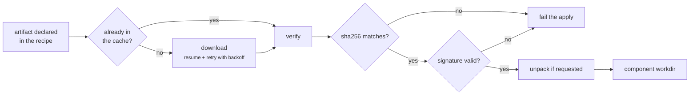

+++
title = "Artifacts"
weight = 34
description = "Downloading, verifying and caching, on a network that drops."
+++

# Artifacts

An artifact is a file a component needs before it can run: a binary, a tarball, a
config bundle. Getting them onto an edge device is its own problem — the link is
slow, expensive and unreliable.

## The download path

**Resume.** Interrupted downloads continue with a range request instead of
starting over. On a metered link that is the difference between a successful update
and a stalled fleet.

**Retry with backoff.** Transient failures are retried; the whole operation is
bounded by `KEYSTONE_ARTIFACT_DOWNLOAD_TIMEOUT` (default 30 m).

**Headers.** Per-artifact headers let you fetch from an authenticated store, and
`github_token` sets the right `Authorization` for private GitHub release assets.

## Verification is mandatory

Both the SHA-256 **and** a detached signature must be present and valid. There is
no "warn and continue" mode: a failed check fails the apply, on both the apply and
the restart path.

The only way out is `--insecure-skip-verify`, which logs a loud warning at startup
and exists for local development. See
[Secure defaults](../../security/secure-defaults/).

## Unpacking

`unpack = true` extracts into the component's working directory, with several
protections that matter when the archive comes off the network:

- **Zip-slip containment** — entries that escape the target directory are refused.
- **Mode stripping** — setuid, setgid and world-writable bits are removed.
- **Size cap** — `KEYSTONE_MAX_EXTRACT_BYTES` bounds the decompressed size, so a
  small archive cannot fill the disk.

## The cache

Artifacts live in `runtime/artifacts/<recipe-name>/<version>/` and are reused
across applies — re-applying a plan downloads nothing.

Two mechanisms keep it bounded:

- **GC**: after a successful apply, directories not referenced by the current plan
  are removed.
- **Budget**: `KEYSTONE_ARTIFACT_CACHE_LIMIT_BYTES` (default 2 GiB) evicts oldest
  first once exceeded.

Version the directory, not the file: keeping `<version>` in the path is what lets a
rollback reuse the previous artifact without downloading it again.
