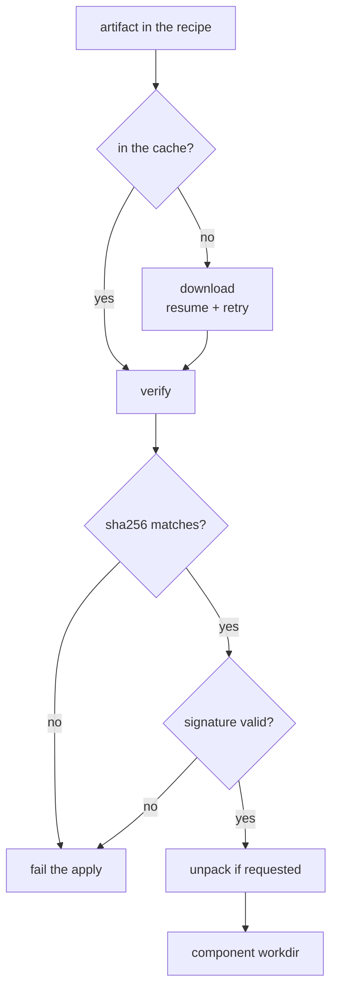
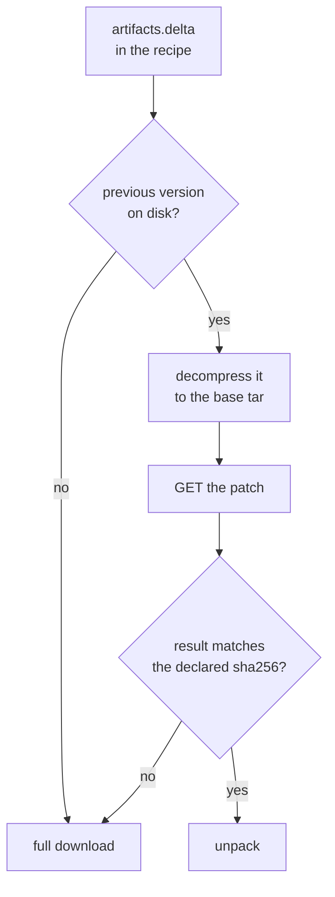

+++
title = "Artifacts"
weight = 34
description = "Downloading, verifying and caching, on a network that drops."
+++

An artifact is a file a component needs before it can run: a binary, a tarball, a
config bundle. Getting them onto an edge device is its own problem — the link is
slow, expensive and unreliable.

## The download path



**Resume.** Interrupted downloads continue with a range request instead of
starting over. On a metered link that is the difference between a successful update
and a stalled fleet.

**Retry with backoff.** Transient failures are retried; the whole operation is
bounded by `KEYSTONE_ARTIFACT_DOWNLOAD_TIMEOUT` (default 30 m).

**Headers.** Per-artifact headers let you fetch from an authenticated store, and
`github_token` sets the right `Authorization` for private GitHub release assets.

## Verification is mandatory

Both the SHA-256 **and** a detached signature must be present and valid. There is
no "warn and continue" mode: a failed check fails the apply, on both the apply and
the restart path.

The only way out is `--insecure-skip-verify`, which logs a loud warning at startup
and exists for local development. See
[Secure defaults](../../security/secure-defaults/).

## Unpacking

`unpack = true` extracts into the component's working directory, with several
protections that matter when the archive comes off the network:

- **Zip-slip containment** — entries that escape the target directory are refused.
- **Mode stripping** — setuid, setgid and world-writable bits are removed.
- **Size cap** — `KEYSTONE_MAX_EXTRACT_BYTES` (2 GiB by default) bounds the
  decompressed size, so a small archive cannot fill the disk.

## Delta downloads

An artifact can opt into being **patched** instead of downloaded whole. The agent
takes the copy of a previous version it already has, applies a patch fetched from a
delta server, and checks the result against a digest the recipe declares.



**The patch transforms the uncompressed tar, not the archive.** This is the whole
design, and it is forced by gzip: one changed byte reshuffles the stream, so a patch
between two `.tar.gz` files is worth nothing. Measured on two adjacent Keystone
releases:

Both rows are measured against the same yardstick: the 13.4 MB `.tar.gz` the agent
would otherwise have downloaded.

| Patch computed over | Size | Share of the download it replaces |
|---|---:|---:|
| The `.tar.gz` as published | 13.1 MB | 98 % |
| The same tar, uncompressed | **1.0 MB** | **8 %** |

So the agent decompresses the cached archive to recover the base, patches that, and
unpacks the result. Nobody has to publish anything in a new format — the `.tar.gz`
stays exactly as it is, and the uncompressed form only ever exists on the device.

**Do not expect a fixed saving.** The 8 % above is two adjacent releases. Across a
release that changed the Go toolchain the same measurement gives 6.3 MB — 47 % of
the archive, still a saving but a far smaller one. Go binaries relayout far more
than the size of the source change suggests.

**None of this is novel, and that is the point.** Shipping an update as a patch
verified against a signed digest of the *result* is how Android A/B OTA works, and
Chrome (Courgette), Debian (debdelta), OSTree static deltas and RAUC all do a
version of the same thing. The parts that are specific to Keystone are narrow: the
patch is taken over the uncompressed archive so that no publishing format has to
change, and the digest that gates the result rides in the recipe — which is already
signed — instead of in a separate manifest with its own key and its own signing
step. If this looks unusual, it is only in what it *avoids* adding.

**There is no handshake.** The agent knows both digests — it hashes the base itself,
and the target digest comes from the recipe — so the patch location is determined:

```
{server}/delta/{sha256 of the base tar}/{sha256 of the target tar}
```

One `GET`. No manifest, no heartbeat, no device registration. Any server exposing
that route works; [ota-updater](https://github.com/carlosprados/ota-updater) does.

**A 404 does not mean "no".** Computing a patch is expensive — about ten seconds
for a 34 MB artifact — so the first request for a pair nobody has asked for yet
finds nothing cached, answers 404 and starts the work in the background. Taking
that at face value would mean a lone device never gets a patch at all: it would
fall back every time, and only a *second* device would find the result. The agent
therefore retries a not-found a few times over about a minute before giving up.
Any other error is final and falls back immediately.

**What verifies the result.** The `sha256` in `[artifacts.delta]`, which is
trustworthy because the recipe carrying it is signature-verified against the trust
bundle before any of it is acted on. No second signature has to be published.

Worth being explicit about the difference: on the full-download path the artifact's
own detached signature proves the *publisher* signed those bytes; on this path the
attestation comes from whoever signed the recipe. Where one trust bundle covers
both, the assurance is the same. Where a deployment deliberately relies on a
separate artifact-publisher key, opting an artifact into deltas moves that trust —
which is why it is off unless a recipe asks for it, per artifact.

**Every failure falls back to the full download**, and none of them fails the apply:
no previous version on disk (a first install), a server holding no patch from this
particular base, a patch that does not apply, a result whose digest does not match,
or a patch format this build does not implement. The last one is why the recipe can
name a `format`: a server that moves to another encoding produces a log line saying
so, rather than feeding bytes to the wrong decoder.

Current limits, deliberately:

- Only artifacts with `unpack = true`. A single file staged verbatim is not covered.
- One base is tried — the most recently written version on disk. Jumping backwards
  across several releases falls back to the full download rather than hunting.
- The delta server is an extra service someone has to run. It is never required:
  an artifact with no `[artifacts.delta]` behaves exactly as it always has, and an
  agent that predates the field ignores it and downloads normally.
- **Patching is done in memory.** The base, the patch and the result are all held
  at once, so peak usage is roughly twice the uncompressed archive. Saving link
  bandwidth costs device RAM, which is the trade to check before enabling it on a
  small box.
- The reconstructed tar is written next to the cached archive and removed with the
  rest of that version's directory by the usual GC, so a patched install briefly
  needs room for both.

## The cache

Artifacts live in `runtime/artifacts/<recipe-name>/<version>/` and are reused
across applies — re-applying a plan downloads nothing.

Two mechanisms keep it bounded:

- **GC**: after a successful apply, directories not referenced by the current plan
  are removed.
- **Budget**: `KEYSTONE_ARTIFACT_CACHE_LIMIT_BYTES` (default 2 GiB) evicts oldest
  first once exceeded.

Version the directory, not the file: keeping `<version>` in the path is what lets a
rollback reuse the previous artifact without downloading it again.
