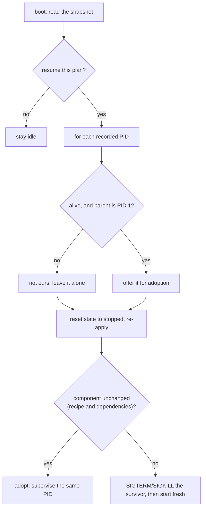

+++
title = "State and recovery"
weight = 35
description = "What survives a reboot, and what happens when the agent is killed."
+++

An edge device loses power. The agent gets OOM-killed. Someone pulls the plug
mid-update. Keystone is built to come back from all three without a human.

## The snapshot

`runtime/state/snapshot.json` holds the plan path, the plan status, the plan's
component mapping, and the last known state of each component (including PIDs).

It is written by a single state poller — twice a second at most, and **only when
something actually changed**. `state.Save` rewrites and renames the file on every
call, so on flash storage an unconditional write loop is real wear for no
information gain.

Writes are atomic: a temp file, a size check, then `rename(2)`. A power cut leaves
either the old snapshot or the new one, never a truncated one.

## Boot: resume or not

On startup the agent reads the snapshot and decides from the persisted plan status:

| Persisted status | Resume? | Why |
|---|---|---|
| `running` | yes | It was running; make that true again |
| `failed` | yes | Try again — the cause may have been transient |
| `applying` | yes | An apply was interrupted mid-flight; re-apply from scratch |
| *(empty)* | yes | Legacy or first run; safest default |
| `stopped` | **no** | An operator stopped it deliberately. Respect that |
| `dry-run` | **no** | Nothing was ever installed |

Unknown future values default to resuming: silently supervising nothing is the
worse failure.

## Adopting or reaping survivors

Here is the subtle part. If the agent dies *without* running its shutdown path —
`SIGKILL`, a segfault, the OOM killer — its children survive. They get reparented
to `init` and keep running, but the new agent has no handles for them. Left alone,
a fresh start would collide with a process nobody is managing: ports stay bound,
lock files stay held.

So on boot the agent offers each survivor for **adoption**, and reaps whatever the
plan does not claim:

The parent-is-`init` test is the safety catch: a PID from a previous boot has
almost certainly been reused by something unrelated, and killing it would be
someone else's outage. Only an init-owned orphan is a plausible leftover.

**Unchanged** means the recipe and every dependency are what they were. It does
not mean "running under supervision" — after a crash nothing is — and the check
asked exactly that up to v0.12.1, so every survivor was reaped. A component whose
recipe moved is never adopted: that would leave the old build running while the
agent reports the new one. Its survivor is killed **before** the new instance
starts, not after the apply: side by side, the new one would find the port bound
or the database locked and fail for something the old process was doing.

An adopted process keeps logging: its output goes to journald streams it holds
itself, not to the dead agent. Its exit is noticed by polling, without an exit
status. Its health probe and restart policy come back with it. Without journald,
output goes through pipes the agent reads, and a component that writes dies from
`SIGPIPE` on its first line after the agent is gone — there is then usually
nothing to adopt.

**Limitation: subreapers.** Under a subreaper — `systemd --user`, a container
with `tini` or `dumb-init` — orphans are reparented to it, not to PID 1. They are
then neither adopted nor reaped, and the resume starts a second copy. Run the
agent under the system manager.

Post-crash, the snapshot's `running` states are treated as **informational, not
authoritative**: they are reset to `stopped` before the reconcile reads them.
A survivor's PID stays in the snapshot until it has been adopted or reaped. If
the agent dies again in between, the next boot still knows the process exists,
rather than starting a second copy beside a process it has forgotten.

## Graceful shutdown

On `SIGINT`/`SIGTERM` the agent stops its adapters with a 10 s deadline and runs
each component's shutdown hook. The plan status stays as it was, so the next boot
resumes — a reboot is not an instruction to stop serving.
