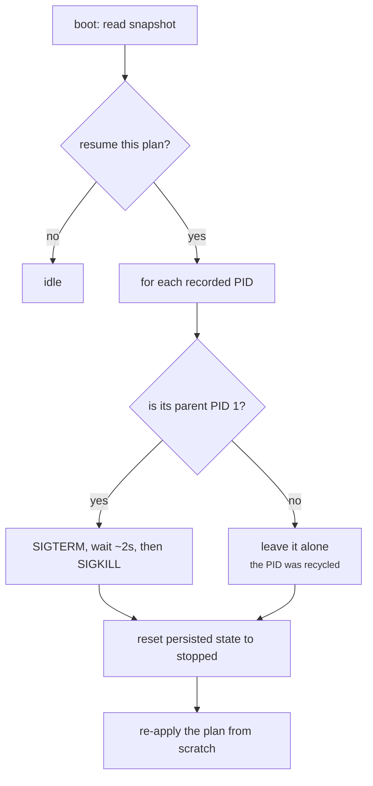

+++
title = "State and recovery"
weight = 35
description = "What survives a reboot, and what happens when the agent is killed."
+++

# State and recovery

An edge device loses power. The agent gets OOM-killed. Someone pulls the plug
mid-update. Keystone is built to come back from all three without a human.

## The snapshot

`runtime/state/snapshot.json` holds the plan path, the plan status, the plan's
component mapping, and the last known state of each component (including PIDs).

It is written by a single state poller — twice a second at most, and **only when
something actually changed**. `state.Save` rewrites and renames the file on every
call, so on flash storage an unconditional write loop is real wear for no
information gain.

Writes are atomic: a temp file, a size check, then `rename(2)`. A power cut leaves
either the old snapshot or the new one, never a truncated one.

## Boot: resume or not

On startup the agent reads the snapshot and decides from the persisted plan status:

| Persisted status | Resume? | Why |
|---|---|---|
| `running` | yes | It was running; make that true again |
| `failed` | yes | Try again — the cause may have been transient |
| `applying` | yes | An apply was interrupted mid-flight; re-apply from scratch |
| *(empty)* | yes | Legacy or first run; safest default |
| `stopped` | **no** | An operator stopped it deliberately. Respect that |
| `dry-run` | **no** | Nothing was ever installed |

Unknown future values default to resuming: silently supervising nothing is the
worse failure.

## Reaping orphans

Here is the subtle part. If the agent dies *without* running its shutdown path —
`SIGKILL`, a segfault, the OOM killer — its children survive. They get reparented
to `init` and keep running, but the new agent has no handles for them. Ports stay
bound, lock files stay held, and a fresh start would collide with a process nobody
is managing.

So before reconciling, the agent walks the PIDs in the snapshot and reaps the ones
that look like orphans from its previous life:

The parent-is-`init` test is the safety catch: a PID from a previous boot has
almost certainly been reused by something unrelated, and killing it would be
someone else's outage. Only an init-owned orphan is a plausible leftover.

Post-crash, the snapshot's `running` states are treated as **informational, not
authoritative** — they are reset to `stopped` before the reconcile reads them, so
the resume starts fresh rather than adopting processes nobody supervises.

## Graceful shutdown

On `SIGINT`/`SIGTERM` the agent stops its adapters with a 10 s deadline and runs
each component's shutdown hook. The plan status stays as it was, so the next boot
resumes — a reboot is not an instruction to stop serving.
