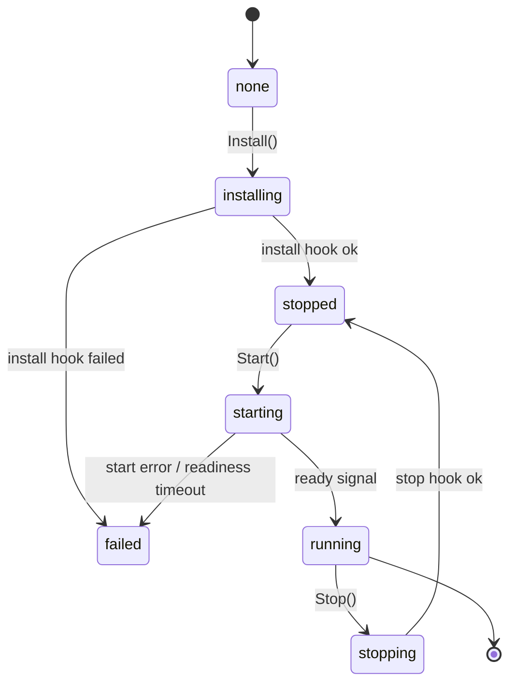

+++
title = "Supervisor"
weight = 32
description = "The state machine and the layered, parallel start."
+++

# Supervisor

The supervisor owns *ordering* and *readiness*. It knows nothing about processes,
containers, artifacts or signatures — it calls hooks.

## The component state machine



`Install` is a no-op unless the component is `none` or `stopped`, and `Start` is a
no-op if it is already `running`. That second rule is what makes component
**reuse** possible: a component marked as already-running has both hooks skipped
entirely.

## Layers

```go
graph := BuildGraph(components)
layers := graph.TopoLayers()      // error if there is a cycle
```

Each layer is started with one goroutine per component, then the supervisor waits
for the whole layer before moving on. Within a layer, install and start run
concurrently; the install phase gets a bounded timeout
(`KEYSTONE_INSTALL_TIMEOUT`, default 2 m) while the start phase does not — the
runner owns that.

## Readiness

A component may expose a readiness channel, which the runner closes when the
workload is genuinely up:

- **without a health check** — as soon as the process is spawned;
- **with a health check** — on the first healthy probe.

`Start` waits on that channel up to a timeout derived from the health interval and
failure threshold. Three outcomes:

| Signal | Result |
|---|---|
| ready channel closes | `running`, next layer proceeds |
| start-error channel fires | `failed`, layer fails immediately — no waiting out the timeout |
| timeout expires | `failed` with `start readiness timeout` |

The start-error path matters for fast feedback: a component that exits during
startup fails the apply in milliseconds instead of stalling it for the full
readiness timeout.

## Unwinding a failed layer

When a layer fails, the supervisor cancels the shared context — which ends every
managed loop it started — and then stops what came up, in reverse layer order.

Keystone's stop hook deliberately delegates to the agent's single teardown path, so
unwinding also deregisters the handle, releases the runner and records the state.
Stopping the process alone would leave a dead handle behind that still reads as
`running` to the API and to the next reconcile — which is exactly the bug that made
[#10](https://github.com/carlosprados/keystone/issues/10) possible.

## Concurrency notes

The bookkeeping of what has started is mutex-guarded: with two components in a
layer, several goroutines write it at once. That was an unguarded map until
recently — a latent `concurrent map write` panic on any plan with a wide layer, now
covered by a test that fails under `-race` if the guard is removed.
