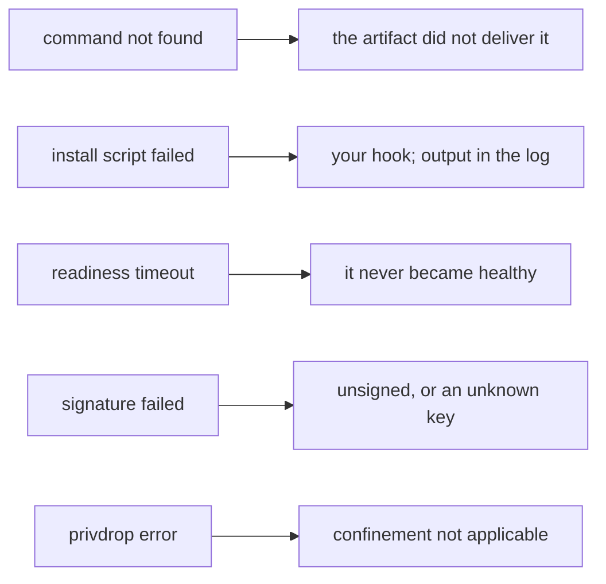

+++
title = "Troubleshooting"
weight = 62
description = "Symptoms, causes and the log line that tells you which."
+++

The agent's log is designed to be greppable: `[agent]`, `[supervisor]` and
`[runner]` prefixes, and `key=value` fields.

## A component will not start




Look for the reason in this order:

```bash
journalctl -u keystone | grep -E "component=<name>|layer failed"
journalctl -t keystone/<name>        # what the component itself printed
```

| Log line | Cause | Fix |
|---|---|---|
| `run command not found: …` | `command` is `./x` and the artifact did not deliver it | Check `unpack`, and the path inside the archive |
| `install script failed: exit status 1` | Your install hook | The trimmed output follows in the log |
| `start readiness timeout` | It never became healthy in time | Raise `interval`/`failure_threshold`, or fix the probe |
| `signature verification failed` | Artifact or recipe is unsigned or signed by an unknown key | See [Signing](../../security/signing/) |
| `privdrop: …` | A privilege restriction could not be applied | See [Process privileges](../../security/process-privileges/) |
| `mandatory (hard) dependency "x" not present in plan` | The recipe needs something the plan does not include | Add it, or make the dependency `soft` |

## The apply failed and everything went back

That is rollback working:

```
[agent] apply failed, attempting rollback to previous plan: plan.toml
apply failed and rollback was completed: api start: start readiness timeout
```

The message names the component and the reason. Fix the recipe, apply again — you
were never left in a half-deployed state.

## A component keeps restarting

```bash
journalctl -u keystone | grep "restarts="
```

Backoff is exponential to 60 s, so a crash loop is slow rather than frantic.
`max_retries` (default 5 for `always`/`on-failure`) is the ceiling; once exhausted
the component goes `failed` and stays there. That is a deliberate stop, not a bug:
a component that failed five times with backoff is not going to succeed on the
sixth for reasons of its own.

## `restart_policy = "on-failure"` and my component just stops

Working as intended. A clean exit (code 0) is not a failure, so it is not
restarted, and the component is reported `stopped` with `pid: 0`. If it should come
back regardless, use `always`.

## The state looks wrong

It should not. If `GET /v1/components` ever reports `running` with a PID that does
not exist, that is a bug worth an issue — the guarantees in
[Component state](../../concepts/component-state/) are meant to be absolute for
process components. Container components are the known exception
([#13](https://github.com/carlosprados/keystone/issues/13)).

To check by hand:

```bash
PID=$(curl -s localhost:8080/v1/components | jq -r '.[] | select(.name=="api") | .pid')
ps -p "$PID" -o pid,user,cmd
```

## The agent came back and started everything again

On boot the agent re-applies the last plan unless it was explicitly stopped.
Components that survived the previous agent and whose recipe and dependencies
are unchanged are **adopted** — same PID, no restart
(`adopted existing process` in the log). Everything else starts fresh, and a
survivor that is not adopted is reaped just before its replacement starts. See
[State and recovery](../../internals/state-and-recovery/).

If everything restarted anyway, the survivors were not there to adopt: the agent
was stopped cleanly (`systemctl stop` or `restart` stop components on purpose),
`KillMode=process` is missing from the unit, or the agent runs under a subreaper.

To keep a device idle across reboots, stop the plan properly
(`POST /v1/plan/stop`) rather than killing the agent — a `stopped` status is
remembered, a `SIGKILL` is not.

## An apply answers 503 "… is in progress"

Only one apply runs at a time, and the answer says which one holds it:

| The message names | Meaning |
|---|---|
| `the resume of the saved plan after the agent started` | The agent just booted and is converging to its own plan. Normal; retry when it finishes |
| `a periodic reconcile` | `--reconcile-interval` fired. Retry in a moment |
| `a plan apply` | Another caller is applying. Check who before retrying over it |

It is a 503, not a 500, because retrying is the right response. A plan status
stuck at `applying`, and `previous apply was interrupted` on the next boot, are a
different thing: an apply that did not finish because the agent died during it.
Look for a `panic` or an OOM kill in the journal.

## Nothing responds on the API

- Bound to loopback (the default) and you are connecting from elsewhere.
- Non-loopback bind without `KEYSTONE_API_TOKEN`: the agent **refuses to start**.
  Check the first lines of the log.
- Token set but not sent: everything except `/healthz` returns 401.

## Useful one-liners

**Read those two together, in that order.** The lists are accurate about what
was decided: a pass that changes nothing prints empty stop/start orders and the
component in `no_touch`, and a pass that restarts something names it.

What the lists cannot tell you is whether a planned reuse survived. A component
in `no_touch` is reused only if the supervisor then finds it alive **and**
healthy; if not, reuse is revoked and it is restarted — and only the
per-component line says so:

```
component=api msg=reusing existing running instance (no restart)
component=api msg=reuse revoked, starting a fresh instance
```

The PID settles any doubt: unchanged means it was reused.

```bash
# States at a glance
curl -s localhost:8080/v1/components | jq -r '.[] | "\(.name)\t\(.state)\t\(.pid)\t\(.last_health)"'

# What the last apply PLANNED — orders from the dependency graph, not a record
# of what happened
journalctl -u keystone | grep "reconcile plan"

# What it actually DID to each component
journalctl -u keystone | grep -E "reusing existing|reuse revoked"

# Confirm a component's confinement
grep -E 'Uid|CapEff|NoNewPrivs' /proc/$(curl -s localhost:8080/v1/components | jq -r '.[0].pid')/status
```
