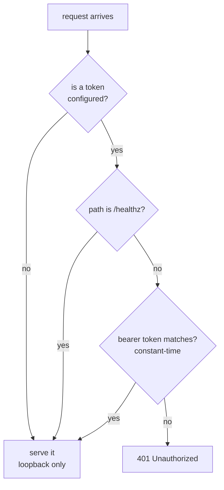

+++
title = "API authentication"
weight = 43
description = "Why the agent refuses to listen on 0.0.0.0 without a token."
+++

The HTTP API can apply plans and run arbitrary install hooks. It is, in effect, a
remote shell. It is treated accordingly.

## The default is loopback

```bash
keystone                       # binds 127.0.0.1:8080
```

Nothing off-device can reach it. To expose it you must provide a token:

```bash
export KEYSTONE_API_TOKEN="$(openssl rand -hex 32)"
keystone --http 0.0.0.0:8080
```

Without one, the agent **refuses to start**:

```
[main] failed to start adapters: refusing to start HTTP API on non-loopback
address ":8080" without authentication: set KEYSTONE_API_TOKEN or bind to 127.0.0.1
```

This is a startup failure, not a warning, because the failure mode it prevents —
an unauthenticated control plane reachable from the factory LAN — is
indistinguishable from working correctly until someone finds it.

## Using the token




```bash
curl -H "Authorization: Bearer $KEYSTONE_API_TOKEN" \
     http://device:8080/v1/components
```

`keystonectl` reads `KEYSTONE_API_TOKEN` from the environment.

Comparison is constant-time, so the token cannot be recovered by timing. `/healthz`
is exempt so an unauthenticated liveness probe still works; it exposes no component
detail.

## Prefer a tunnel to an exposed port

The most common reason to bind a non-loopback address is simply wanting to run
`keystonectl` from a laptop. That is a poor trade: it turns a privileged local
surface into a network one, and the token then travels in plaintext.

`keystonectl --ssh` removes the reason. It carries the request to the device over
your own SSH client, so the agent keeps listening only on its own loopback:

```bash
keystonectl --ssh ops@edge-001 --addr http://127.0.0.1:9180 components
```

`--addr` is resolved on the far side. Authentication, host key verification and
key handling are `ssh`'s, following your `~/.ssh/config` — Keystone introduces no
key material and no cryptography of its own for this. See
[the CLI reference](../../reference/keystonectl/#reaching-an-agent-bound-to-loopback).

## What is still your job

- **TLS.** Keystone does not terminate TLS. Put it behind a reverse proxy, or reach
  it over a VPN or an SSH tunnel (`keystonectl --ssh`, above). A bearer token on
  plaintext HTTP over an untrusted network is a token you have given away.
- **One token per device.** A fleet-wide shared token means one compromised device
  compromises the fleet.
- **Rotation.** The token comes from the environment, so rotation is a config
  change plus a restart.

## Hardening the surface

Already applied, no configuration needed: request bodies are capped
(`KEYSTONE_MAX_REQUEST_BYTES`, 4 MiB default) with a 413 on overflow; header, read
and idle timeouts defeat slowloris; and `planPath` is rejected in favour of content
upload, so the API cannot be used to read arbitrary files off the device.
