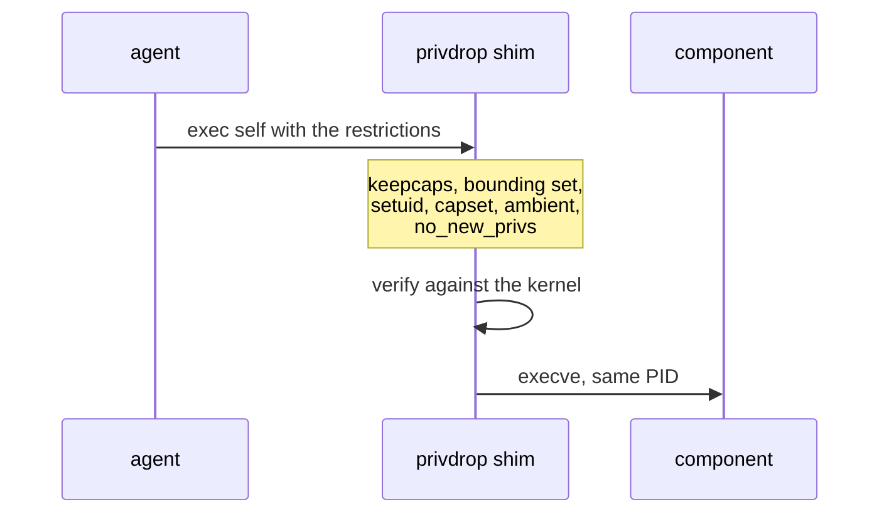
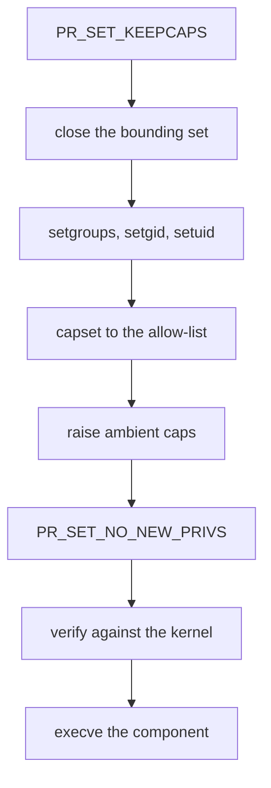

+++
title = "Process privileges"
weight = 44
description = "Per-component user, capabilities and no_new_privileges — and how they are enforced."
+++

By default a process component inherits everything from the agent: same uid, full
capability set, `NoNewPrivs=0`. And the agent usually **has** to run as root — it
writes systemd units, installs into `/usr/local/bin`, touches `/etc`. So without
this feature, every component runs as unconfined root, and any memory-safety bug in
any of them is a full host compromise.

{}
The cook has the keys to the whole house. That does not mean every helper needs
them. Each helper gets exactly one key — the one for the cupboard they work in —
and they are told they may never pick up another key, ever.
{}

## The recipe block

```toml
[lifecycle.run.security]
user = "svc:svc"                          # "user", "uid", "user:group" or "uid:gid"
no_new_privileges = true                  # PR_SET_NO_NEW_PRIVS
capabilities = ["CAP_NET_BIND_SERVICE"]   # allow-list; [] means none at all
```

These are the same names as the systemd directives they replace — `User=`,
`NoNewPrivileges=`, `AmbientCapabilities=` — so an existing unit can be copied
across.

Two details worth knowing:

- Omitting `capabilities` leaves capabilities alone. Declaring it as `[]` drops
  **all** of them. `nil` and `[]` differ on purpose.
- Giving only a user (`user = "svc"`) uses that user's primary group and its
  supplementary groups, as systemd does. A bare numeric uid with no entry in the
  user database is rejected rather than silently defaulting to group 0.

**Process components only.** Containers are confined through
`[lifecycle.run.container]`. Declaring `[lifecycle.run.security]` on a container
component is an error, and so is setting `container.user` / `container.privileged`
on a process component. A misplaced restriction is refused, never ignored.

## How it is enforced

Dropping the capability bounding set and setting `PR_SET_NO_NEW_PRIVS` are
per-process and **irreversible**. Doing them in the agent would confine the agent
itself and everything it ever starts afterwards.

So the agent re-executes its own binary as a shim:



`execve` replaces the process image, so the **PID does not change** — supervision,
metrics and `GET /v1/components` are unaffected.

### Why that order




Each step is where it is for a reason:

1. **`PR_SET_KEEPCAPS`** — otherwise the uid change wipes the permitted set and
   there would be nothing left to grant.
2. **Close the bounding set** — `PR_CAPBSET_DROP` needs `CAP_SETPCAP` in the
   *effective* set, and `setuid` clears the effective set. It must happen first.
3. **`setgroups` → `setgid` → `setuid`** — always set the supplementary groups,
   including to empty. Inheriting the agent's groups (root's) would hand the
   component access the recipe never asked for.
4. **`capset`, then raise ambient** — the ambient set is what survives `execve` for
   a binary without file capabilities, which is the normal case. Skipping it leaves
   the component with nothing.
5. **`PR_SET_NO_NEW_PRIVS`**, then verify, then exec.

## Fail-closed and verified

If any requested restriction cannot be applied, the shim exits non-zero and the
component fails to start like any other start failure. An unconfined process is
never the fallback.

Verification reads the result **back from the kernel** — `getuid`, `capget`,
`PR_CAP_AMBIENT_IS_SET`, `PR_GET_NO_NEW_PRIVS` — rather than trusting that the
syscalls returned 0. That check earned its keep during development: an early
version had every syscall succeed while the capability never reached the ambient
set, so the component would have exec'd with no capabilities at all. Checking
permitted and effective did not catch it; checking ambient did.

Two cases behave deliberately:

- **Asking for a capability the agent does not hold** fails with an explanation. A
  process can only ever narrow its own capabilities.
- **A non-root agent cannot narrow the bounding set** (`PR_CAPBSET_DROP` needs
  `CAP_SETPCAP`). With `no_new_privileges = true` this is logged and accepted,
  because the bounding set can only be exploited by an `execve` that grants
  privileges — precisely what `no_new_privileges` forbids. Without it, the hole is
  real and the component is refused.

## Verify it on a device

```console
$ grep -E 'Uid|Gid|CapEff|CapBnd|CapAmb|NoNewPrivs' /proc/<pid>/status
Uid:	65534	65534	65534	65534
Gid:	65534	65534	65534	65534
CapEff:	0000000000000400      # 0x400 = bit 10 = CAP_NET_BIND_SERVICE, and only that
CapBnd:	0000000000000400
CapAmb:	0000000000000400
NoNewPrivs:	1
```

Do this once per confined component the first time you deploy it. The guarantee is
only worth what you have checked.

## Not covered

Filesystem and namespace confinement — the equivalent of `ProtectSystem=`,
`PrivateTmp=`, mount namespaces — is not implemented. If you need it, run the
component as a container, or wrap it in a systemd scope.
