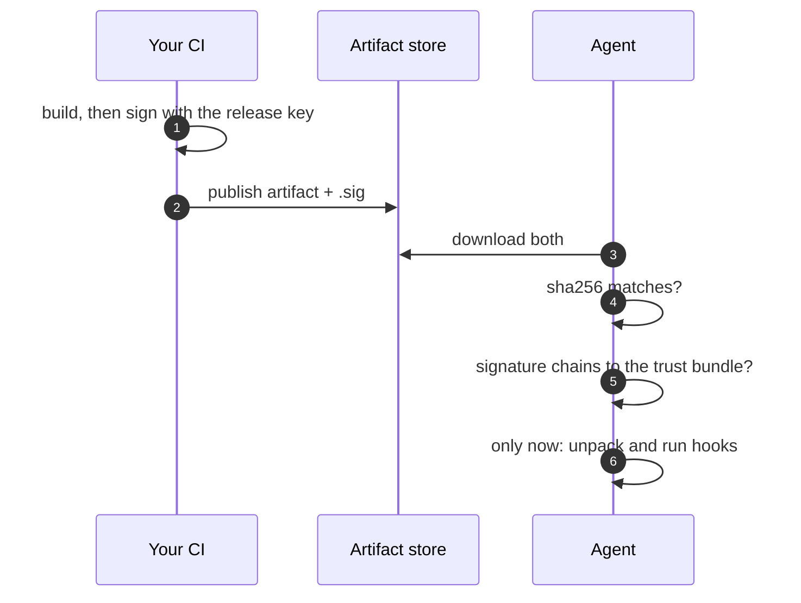

+++
title = "Signing"
weight = 42
description = "How trust reaches the device, and how to set it up."
+++

Everything the agent installs must be traceable to a key you control. That is done
with **detached signatures** verified against a **trust bundle** on the device.

## What gets verified

| Thing | Signature | When it is checked |
|---|---|---|
| Artifact | `sig_uri` (or `<uri>.sig`) | Before it is unpacked or used, on apply **and** restart |
| Recipe file | `<recipe>.toml.sig` | Before any lifecycle hook runs |
| Recipe via API | — | Trusted by the API authentication instead |

The order matters for recipes: the install hook is arbitrary shell, so verifying
after running it would be pointless.




## Trust bundle

Point the agent at a PEM file of CA certificates:

```bash
export KEYSTONE_TRUST_BUNDLE=/etc/keystone/trust/ca.pem
keystone --http 127.0.0.1:8080
```

Signatures are ECDSA or RSA over the file's contents, verified against a leaf
certificate that must chain to the bundle. The leaf can be provisioned on the
device or fetched per artifact with `cert_uri`.

## Setting it up for development

The repository ships a helper that creates a throwaway CA and signs things with it:

```bash
./scripts/dev-sign.sh init                        # create a dev CA
./scripts/dev-sign.sh recipe recipes/api.toml     # → recipes/api.toml.sig
./scripts/dev-sign.sh artifact dist/api-1.4.0.tar.gz
```

Then run the agent with `KEYSTONE_TRUST_BUNDLE` pointing at the generated CA. See
`configs/trust/README.md` for the long form, including how to lay this out for
production with a real CA.

{}
A dev CA is a dev CA. For real fleets the signing key belongs in an HSM or a
CI-managed KMS, and the private key should never touch a developer laptop.
{}

## Rotating

The trust bundle is a file of CA certificates, so rotation is: add the new CA to
the bundle, ship it, start signing with the new key, then remove the old CA once
nothing signed by it remains in any plan you might roll back to.

That last clause is the one people get wrong. A rollback re-applies an **older**
plan with older artifacts — if you have already dropped the CA that signed them, the
rollback fails closed. Keep the old CA for at least as long as your rollback
horizon.
