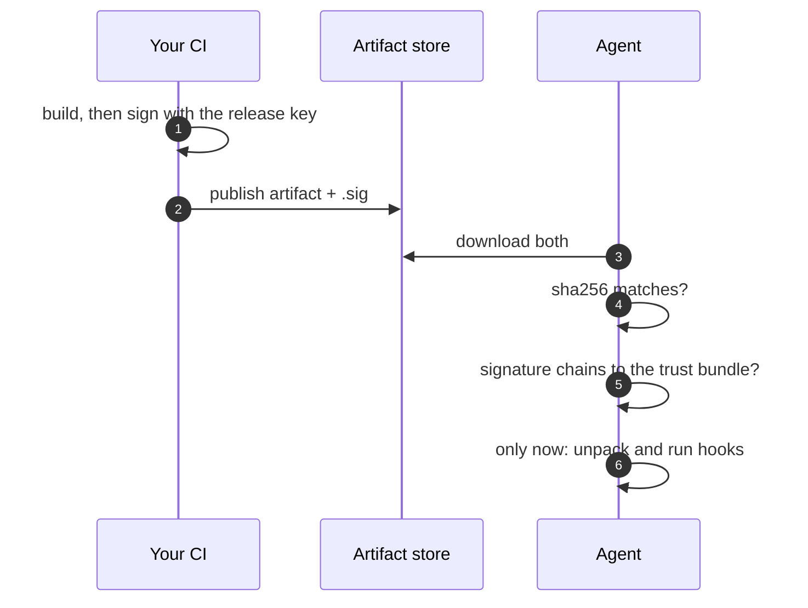

+++
title = "Signing"
weight = 42
description = "How trust reaches the device, and how to set it up."
+++

Everything the agent installs must be traceable to a key you control. That is done
with **detached signatures** verified against a **trust bundle** on the device.

## What gets verified

| Thing | Signature | When it is checked |
|---|---|---|
| Artifact | `sig_uri` (or `<uri>.sig`) | Before it is unpacked or used, on apply **and** restart |
| Recipe file | `<recipe>.toml.sig` | Before any lifecycle hook runs |
| Recipe via API | — | Trusted by the API authentication instead |

The order matters for recipes: the install hook is arbitrary shell, so verifying
after running it would be pointless.




## Trust bundle

Point the agent at a PEM file of CA certificates:

```bash
export KEYSTONE_TRUST_BUNDLE=/etc/keystone/trust/ca.pem
keystone --http 127.0.0.1:8080
```

Signatures are **RSA, ECDSA or Ed25519**, verified against a leaf certificate
that must chain to the bundle. The leaf can be provisioned on the device or
fetched per artifact with `cert_uri`.

### The scheme, exactly

The signed message is the file's **32-byte SHA-256 digest**, for every
algorithm. For Ed25519 that means the digest is the message and the scheme is
**not** Ed25519ph — Ed25519 hashes what it is given with SHA-512 internally, so
it hashes the digest. Signer and verifier must agree on this or nothing
validates, which is why it is written here rather than left to be read out of
the code.

{}
Support for Ed25519 was added after RSA and ECDSA. An agent from before it
rejects an Ed25519 signature as an unsupported key type — correctly, failing
closed. Do not start signing with Ed25519 until the fleet runs a build that
understands it.
{}

## Signing

`keystonectl` signs; the agent never does:

```bash
keystonectl sign --key signer.key --cert signer.pem com.example.api.recipe.toml
# → com.example.api.recipe.toml.sig

keystonectl verify --trust-bundle ca.pem com.example.api.recipe.toml
# → OK: ... verifies against ca.pem
```

`sign` is local and contacts no agent. When `--cert` is given the signature is
checked against that certificate before anything is written, so a mismatched key
and certificate fail at your desk instead of on every device.

Run `keystonectl verify` in CI on every publication. A signature that fails there
fails on the whole fleet, and finding out now costs nothing.

{}
`internal/signing` is linked into `keystonectl` only, and a test fails the build
if `cmd/keystone` ever links it. A gateway in a plant is the most exposed thing
in the system; one that carried signing machinery would hand whoever took it a
head start on forging updates for everything else.
{}

## Setting it up for development

The repository ships a helper that creates a throwaway CA on first use and signs
each file you pass it:

```bash
scripts/dev-sign.sh configs/examples/com.keystone.server.recipe.toml
# creates configs/trust/{ca,leaf}.{key,pem} once, then writes <file>.sig

export KEYSTONE_TRUST_BUNDLE=configs/trust/ca.pem
export KEYSTONE_LEAF_CERT=configs/trust/leaf.pem
```

See `configs/trust/README.md` for the long form, including how to lay this out
for production with a real CA.

{}
A dev CA is a dev CA. For real fleets the signing key belongs in an HSM or a
CI-managed KMS, and the private key should never touch a developer laptop.
{}

## Rotating

The trust bundle is a file of CA certificates, so rotation is: add the new CA to
the bundle, ship it, start signing with the new key, then remove the old CA once
nothing signed by it remains in any plan you might roll back to.

That last clause is the one people get wrong. A rollback re-applies an **older**
plan with older artifacts — if you have already dropped the CA that signed them, the
rollback fails closed. Keep the old CA for at least as long as your rollback
horizon.
